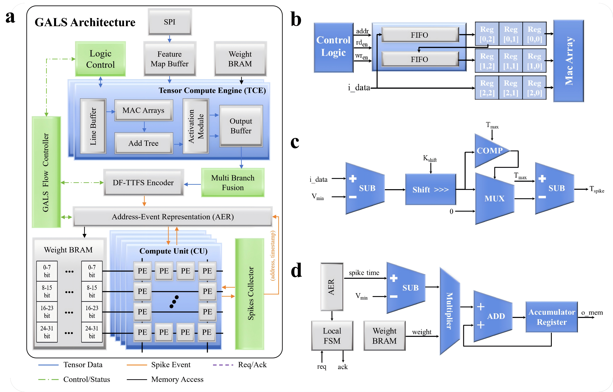
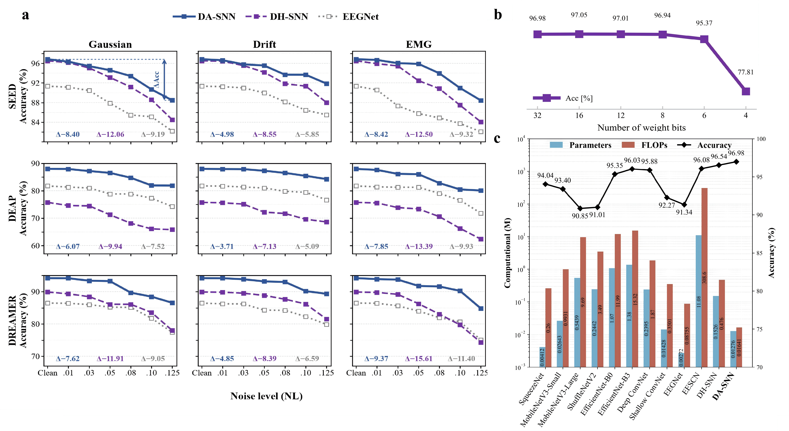

# 审稿意见回复（Response to Reviewers）

**论文：** "An Asynchronous Neuromorphic Architecture for Wearable EEG Emotion Recognition"（一种用于可穿戴脑电情绪识别的异步神经形态架构）

**稿件编号：** NSR_MS-2026-878

---

　　尊敬的编辑与各位审稿人：

　　我们衷心感谢编辑和所有审稿人的细致评审与建设性意见。他们的建议帮助我们改进了稿件的方法透明度、实证支撑、可复现性、硬件核算与表述质量。

　　我们已逐条回应了每一条意见，并将相应的修改纳入正文（main manuscript）和补充材料（Supplementary Information）。

　　为清晰起见，以下每个编号问题均独立作答。在每条内，回复先给出直接答复，再说明理由、报告相关结果，最后以下划线形式展示修改后的稿件措辞。凡是为使每条答复自成一体所必需的表格和图形都会重复给出；因此读者无需从其他意见或稿件中重构答复。

---

  

# 对审稿人 1 意见的回复（Responses to Comments of Reviewer 1）

## 意见 1.1

> "虽然结果是在五个数据集上报告的，但尚不清楚实验实际上是如何进行的。例如，SEED 上报告的 96.98% 准确率并未说明它是基于被试相关（subject-dependent）训练还是跨会话（cross-session）设置。DEAP 和 DREAMER 也存在同样的问题，其数据划分策略未作描述。"

### 回复 1.1

　　我们感谢审稿人强调需要明确陈述评估协议。因此，我们已明确说明了划分单元、可能的被试重叠，以及主被试相关基准与独立的被试无关分析之间的区别。

　　正文表 1（Main Table 1）现在将全部五个数据集上的主要评估明确标识为：被试相关、按类别分层（class-stratified）的随机窗口级 80/20 基准测试；因此 SEED 结果并非跨会话评估。修改后的表报告种子 1–5 下的 96.85% ± 1.44%。独立的被试无关分析在补充材料中报告，不用于定义正文表 1 的基准。

　　被试相关协议和修改后的汇总结果见**正文表 1 及"Emotion Recognition Performance Across EEG Benchmarks"（跨 EEG 基准的情绪识别性能）小节**。完整的划分定义见**补充方法"Evaluation Protocols, Model Selection, and Statistics"（评估协议、模型选择与统计）及补充表 S3**；独立的被试无关结果列于补充表 S4–S5。

**修改后正文表述（节选）：**

> "Table 1 compares 15 models on five EEG emotion recognition datasets under a subject-dependent random window-level 80/20 protocol. Subject-independent performance was evaluated separately using leave-one-subject-out (LOSO) for SEED, SEED-IV, and SEED-V and five fixed subject-holdout splits for DEAP and DREAMER (Supplementary Tables S4 and S5); the corresponding protocols are detailed in the Supplementary Methods."

　　（中文大意：表 1 在被试相关随机窗口级 80/20 协议下比较了五个 EEG 情绪识别数据集上的 15 个模型。被试无关性能使用留一被试法（LOSO）对 SEED、SEED-IV 和 SEED-V 单独评估，并对 DEAP 和 DREAMER 使用五个固定被试留出划分（补充表 S4 和 S5）；相应协议详见补充方法。）

**补充表 S3（数据集组成与评估协议）。** "4/4/1"、"9/9/1.5" 和 "9/9/1" 分别表示外层窗口时长/步长/PSE bin 长度（秒）。

| 数据集 | 被试数 | 会话数 | 试次数 | 外层窗口/步长/PSE bin（s） | 主基准 | 被试无关评估 |
|--------|--------|--------|--------|---------------------------|--------|--------------|
| SEED | 15 | 3 | 15/会话 | 4/4/1 | 随机窗口，80/20 | LOSO，15 个留出被试划分 |
| SEED-IV | 15 | 3 | 24/会话 | 4/4/1 | 随机窗口，80/20 | LOSO，15 个留出被试划分 |
| SEED-V | 20 | 3 | 15/会话 | 4/4/1 | 随机窗口，80/20 | LOSO，20 个留出被试划分 |
| DEAP | 32 | 1 | 40/被试 | 9/9/1.5 | 随机窗口，80/20 | 五个固定划分，26 训练/6 留出被试 |
| DREAMER | 23 | 1 | 18/被试 | 9/9/1 | 随机窗口，80/20 | 五个固定划分，19 训练/4 留出被试 |

---

## 意见 1.2

> "某些关键组件的作用也不甚清晰。论文将性能提升归因于自适应时间窗（adaptive temporal window）和门控机制（gating mechanisms），但正文并未真正展示实际情况。补充材料包含一些理论讨论，但正文中几乎没有支持这些论断的证据。"

### 回复 1.2

　　我们感谢审稿人要求提供直接证据，证明自适应时间窗和 DSGM 确实如所述那样工作，而不是仅依赖理论解释。我们通过增加匹配的组件对比和一条时间窗演化轨迹来回应。

　　修改后的 Results 报告了匹配对比：将自适应时间窗替换为固定时间窗，以及移除 DSGM。这些对比量化了相应的准确率变化，而补充图 S3 展示了两个隐藏层时间边界在训练过程中的演化和收敛。在 SEED、DEAP 和 DREAMER 上，替换自适应时间窗使平均准确率分别从 96.85%、87.96% 和 94.18% 降至 91.87%、77.21% 和 93.35%；移除 DSGM 使相应均值分别降至 93.65%、70.38% 和 93.81%。因此，这两个组件在代表性训练轨迹之外还有可测量的效应，尽管幅度随数据集而异。

　　我们将这些发现总结在**正文 Results 中"Emotion Recognition Performance Across EEG Benchmarks"小节**，并在**补充材料"Ablation Studies"（消融研究）、表 S6 和图 S3** 中报告完整证据。修改后的 Results 文字、消融表和时间窗轨迹摘录如下。

**修改后正文表述（节选）：**

> "Ablations across datasets further separate the roles of the principal components (Supplementary Table S6). Replacing the adaptive temporal window with fixed windows or removing DSGM lowers mean accuracy on SEED, DEAP, and DREAMER, although the magnitude varies by dataset. Conventional min–max normalization produces mixed differences relative to DF-TTFS, positioning DF-TTFS as an encoding for hardware that removes floating-point division rather than as a source of consistent accuracy gains. A representative SEED training trajectory also shows that the temporal boundaries of the two hidden layers evolve to distinct ranges and settle during late training (Supplementary Fig. S3)."

　　（中文大意：跨数据集消融进一步分离了各主要组件的作用（补充表 S6）。将自适应时间窗替换为固定窗或移除 DSGM 会降低 SEED、DEAP 和 DREAMER 上的平均准确率，尽管幅度随数据集而异。传统最小–最大归一化相对 DF-TTFS 产生混合差异，这使 DF-TTFS 定位为面向硬件、去除浮点除法的编码方式，而非持续准确率增益的来源。一条代表性的 SEED 训练轨迹还表明，两个隐藏层的时间边界演化到不同区间并在训练后期趋于稳定（补充图 S3）。）

**补充表 S6（跨数据集消融结果）。** 在被试相关随机窗口级 80/20 协议下评估。数值为五个随机种子（1–5）下的均值 ± 样本标准差。Acc，窗口级准确率；F1，宏平均 F1；Spe，宏平均特异度。

| 数据集 | 变体 | Acc (%) | F1 (%) | Spe (%) |
|--------|------|---------|--------|---------|
| SEED | 完整 DA-SNN | 96.85 ± 1.44 | 96.81 ± 0.92 | 97.08 ± 0.87 |
| SEED | 标准卷积 | 94.98 ± 0.51 | 94.95 ± 1.06 | 95.17 ± 0.45 |
| SEED | 移除 DSGM | 93.65 ± 0.78 | 93.78 ± 1.33 | 93.41 ± 1.00 |
| SEED | 标准最小–最大 | 96.91 ± 1.02 | 96.89 ± 1.46 | 97.15 ± 1.08 |
| SEED | 固定时间窗 | 91.87 ± 0.54 | 91.82 ± 0.68 | 92.03 ± 1.45 |
| DEAP | 完整 DA-SNN | 87.96 ± 5.44 | 86.83 ± 8.53 | 97.62 ± 3.20 |
| DEAP | 标准卷积 | 83.12 ± 6.32 | 81.89 ± 1.79 | 95.75 ± 2.80 |
| DEAP | 移除 DSGM | 70.38 ± 3.16 | 67.27 ± 3.95 | 91.25 ± 5.70 |
| DEAP | 标准最小–最大 | 86.89 ± 1.55 | 74.93 ± 5.48 | 93.68 ± 7.96 |
| DEAP | 固定时间窗 | 77.21 ± 2.46 | 75.18 ± 5.83 | 93.77 ± 5.32 |
| DREAMER | 完整 DA-SNN | 94.18 ± 2.20 | 91.73 ± 2.56 | 94.38 ± 4.64 |
| DREAMER | 标准卷积 | 88.78 ± 1.42 | 84.99 ± 2.38 | 92.43 ± 4.70 |
| DREAMER | 移除 DSGM | 93.81 ± 5.01 | 90.95 ± 4.52 | 94.27 ± 0.88 |
| DREAMER | 标准最小–最大 | 94.84 ± 2.92 | 92.83 ± 3.63 | 96.31 ± 2.81 |
| DREAMER | 固定时间窗 | 93.35 ± 1.55 | 91.00 ± 3.29 | 95.33 ± 0.78 |

**补充图 S3（自适应时间窗演化）。** 在 SEED 上一次代表性 200 轮（epoch）训练运行中的自适应时间窗演化。实线和虚线分别表示每一层的上边界和下边界，点线表示窗口宽度。每个值在对应训练轮次后记录。最后 20 轮的变化描述该次运行内的时序波动。表 S6 另行报告自适应边界被固定窗替代时跨随机种子的性能。

---

## 意见 1.3

> "消融研究相当有限。它仅在 SEED 数据集上进行，主要模块未在信号特性和通道配置不同的 DEAP 或 DREAMER 上测试。缺少这些结果，就难以判断性能提升是否跨数据集一致。"

### 回复 1.3

　　我们感谢审稿人指出原始仅 SEED 消融范围的局限。它没有检验组件效应是否在不同信号统计特性和通道布局下依然成立，因此我们将同样的受控对比扩展到了 DEAP 和 DREAMER。

　　我们将消融研究扩展到了 SEED、DEAP 和 DREAMER。在相同的被试相关随机窗口级 80/20 协议下、使用随机种子 1–5，评估了完整 DA-SNN、标准卷积、移除 DSGM、传统最小–最大归一化以及固定时间窗。结果表明，组件效应并不局限于 SEED，但其幅度随数据集而异。

　　跨数据集解读现在见**正文 Results 中"Emotion Recognition Performance Across EEG Benchmarks"小节**，协议和完整结果见**补充材料"Ablation Studies"及表 S6**。新增的方法学描述如下。

**修改后正文表述（节选）：**

> "We expanded the ablation study from SEED to SEED, DEAP, and DREAMER to test the principal components across different channel configurations and emotion label structures. Five controlled conditions were evaluated under the subject-dependent random window-level 80/20 protocol. The first three were the complete DA-SNN, standard convolution in place of depthwise separable convolution, and removal of DSGM. The remaining conditions used conventional floating-point min–max normalization or fixed temporal windows for each layer. Each condition used the same five random seeds (1–5). Table S6 reports the arithmetic mean and sample standard deviation (ddof=1) across these five runs."

　　（中文大意：我们将消融研究从 SEED 扩展到 SEED、DEAP 和 DREAMER，以在不同通道配置和情绪标签结构下测试主要组件。在被试相关随机窗口级 80/20 协议下评估了五个受控条件。前三个是完整 DA-SNN、以标准卷积替代深度可分离卷积，以及移除 DSGM。其余条件对每层使用传统浮点最小–最大归一化或固定时间窗。每个条件使用相同的五个随机种子（1–5）。表 S6 报告这五次运行的算术均值和样本标准差（ddof=1）。）

　　完整的数值对比在此重复给出，以便审稿人直接在本回复中评估跨数据集一致性。

**补充表 S6（跨数据集消融结果，再次给出）。** 在被试相关随机窗口级 80/20 协议下评估。数值为五个随机种子（1–5）下的均值 ± 样本标准差。

| 数据集 | 变体 | Acc (%) | F1 (%) | Spe (%) |
|--------|------|---------|--------|---------|
| SEED | 完整 DA-SNN | 96.85 ± 1.44 | 96.81 ± 0.92 | 97.08 ± 0.87 |
| SEED | 标准卷积 | 94.98 ± 0.51 | 94.95 ± 1.06 | 95.17 ± 0.45 |
| SEED | 移除 DSGM | 93.65 ± 0.78 | 93.78 ± 1.33 | 93.41 ± 1.00 |
| SEED | 标准最小–最大 | 96.91 ± 1.02 | 96.89 ± 1.46 | 97.15 ± 1.08 |
| SEED | 固定时间窗 | 91.87 ± 0.54 | 91.82 ± 0.68 | 92.03 ± 1.45 |
| DEAP | 完整 DA-SNN | 87.96 ± 5.44 | 86.83 ± 8.53 | 97.62 ± 3.20 |
| DEAP | 标准卷积 | 83.12 ± 6.32 | 81.89 ± 1.79 | 95.75 ± 2.80 |
| DEAP | 移除 DSGM | 70.38 ± 3.16 | 67.27 ± 3.95 | 91.25 ± 5.70 |
| DEAP | 标准最小–最大 | 86.89 ± 1.55 | 74.93 ± 5.48 | 93.68 ± 7.96 |
| DEAP | 固定时间窗 | 77.21 ± 2.46 | 75.18 ± 5.83 | 93.77 ± 5.32 |
| DREAMER | 完整 DA-SNN | 94.18 ± 2.20 | 91.73 ± 2.56 | 94.38 ± 4.64 |
| DREAMER | 标准卷积 | 88.78 ± 1.42 | 84.99 ± 2.38 | 92.43 ± 4.70 |
| DREAMER | 移除 DSGM | 93.81 ± 5.01 | 90.95 ± 4.52 | 94.27 ± 0.88 |
| DREAMER | 标准最小–最大 | 94.84 ± 2.92 | 92.83 ± 3.63 | 96.31 ± 2.81 |
| DREAMER | 固定时间窗 | 93.35 ± 1.55 | 91.00 ± 3.29 | 95.33 ± 0.78 |

　　这些数据表明，完整模型在全部三个数据集上的平均准确率始终强于固定窗和移除 DSGM 变体。它们也说明了为何我们现在将组件效应描述为随数据集而异，而不是声称统一的增益。

---

## 意见 1.4

> "硬件部分不太容易理解。在图 4(a) 中，同步部分与异步部分之间的交互没有得到清晰说明，握手机制（handshake mechanism）仅被简要提及。也不清楚所声称的 GALS 设计能效是如何实现的，例如它与事件稀疏性（event sparsity）或时钟门控（clock gating）的关系。"

### 回复 1.4

　　我们感谢审稿人指出同步—异步边界和能耗降低来源的问题。我们已在回复中明确了现有视觉约定，并相应扩展了控制级描述。

　　现有的图 4(a) 使用不同的线型和颜色标识数据路径：蓝色表示张量数据，橙色表示脉冲事件，紫色虚线表示 Req/Ack，绿色点划线表示控制/状态，细黑线表示存储访问。两个局部时钟域及其 AER 边界在"Hardware Implementation"一节中标识。本次大修前就已存在的补充图 S1 给出了捆绑数据（bundled-data）四阶段握手序列：地址/时间戳载荷在 Req 之前保持稳定，在同步后的 Ack 期间保持稳定，只有在 Req–Ack 归零序列之后才被释放。

　　该修改还区分了三种能效机制：模型引发的脉冲稀疏性减少了事件传输、权值读取和膜电位更新；事件触发执行仅在有效事件时激活路由、存储和 CU/PE 操作；局部寄存器时钟使能减少了空闲动态翻转。

　　相应解释见**图 4 图注和"Hardware Implementation"**；事务时序规定于**补充材料"Detailed Hardware Control Protocol"（详细硬件控制协议）和图 S1**，能效机制在同一补充节中描述。

**修改后正文表述（节选）：**

> "Event transfer uses a bundled-data four-phase protocol. When DF-TTFS generates a valid spike time $t_i$, the sending interface places the address and timestamp on the payload bus, allows the bus to stabilize, and asserts Req. The payload remains unchanged throughout the Req–Ack transaction. Req passes through a synchronizer with two stages into the clk_SNN island. The receiver then samples the stable payload and decodes its destination from the current layer and controller state. It enables the required CU/PE array and schedules the membrane potential update. When all target updates for the event are complete, the receiver asserts acknowledgment (Ack). Ack returns through a synchronizer with two stages to the clk_TCE island."

　　（中文大意：事件传输使用捆绑数据四阶段协议。当 DF-TTFS 生成有效脉冲时间 $t_i$ 时，发送接口将地址和时间戳置于载荷总线上，让总线稳定，然后置位 Req。载荷在整个 Req–Ack 事务期间保持不变。Req 通过两级同步器进入 clk_SNN 域。接收端随后采样稳定载荷，并根据当前层和控制器状态解码其目的地，使能所需的 CU/PE 阵列并调度膜电位更新。当该事件的所有目标更新完成后，接收端置位应答（Ack）。Ack 通过两级同步器返回 clk_TCE 域。）

> "The architecture has three distinct efficiency mechanisms. First, *event sparsity in the model*: TTFS generates at most one spike per neuron per inference cycle. Censored neurons generate no event, reducing AER transfers, weight reads, and membrane updates. Second, *event-triggered execution and data movement*: routing, local memory access, and CU/PE updates occur only for accepted events. Third, *local clock enable control*: completed or inactive datapaths retain state and avoid unnecessary clocked updates. The third mechanism reduces dynamic switching activity while leaving static power unchanged. The matched synchronous comparison below evaluates the net implementation trade-off, including mechanisms beyond event rate alone."

　　（中文大意：该架构有三种不同的能效机制。第一，*模型中的事件稀疏性*：TTFS 每个神经元每个推理周期至多产生一个脉冲。被截断的神经元不产生事件，从而减少 AER 传输、权值读取和膜电位更新。第二，*事件触发的执行与数据移动*：路由、局部存储访问和 CU/PE 更新仅对已接受事件发生。第三，*局部时钟使能控制*：已完成或非活动的数据通路保持状态，避免不必要的时钟更新。第三种机制降低动态翻转活动，同时保持静态功耗不变。下文的匹配同步对比评估净实现权衡，涵盖不止事件率本身的机制。）

**图 4（所提出的加速器硬件架构与主要组件）。** (a) 全局异步局部同步（GALS）加速器的组织。蓝色实线追踪从流式 INT8 张量计算引擎（TCE）到免除法首脉冲时间（DF-TTFS）编码器的张量数据。橙色实线追踪地址事件表示（AER）脉冲事件穿过计算单元和处理器元（CU/PE）阵列。每个事件携带地址和时间戳，隐藏层事件进入再循环路径。紫色虚线表示请求/应答（Req/Ack）握手，绿色点划线表示控制和状态，细黑线表示存储访问。经 DF-TTFS 的张量流水线属于局部 clk_TCE 域。权值存储器、CU/PE 阵列和脉冲收集器属于独立的 clk_SNN 域，AER 块构成复合时钟域边界。 (b) 用移位寄存器实现的行缓冲，连续重建滑动窗口以支持流水线卷积。 (c) DF-TTFS 编码器的硬件实现，通过位移位归一化和有效事件检测产生 AER 脉冲。 (d) 事件驱动 PE 的微架构，展示膜电位积分、时间调制和局部时钟使能控制。GALS 流控制器协调启动、使能、完成以及层或阵列状态。它只携带控制和状态信号，每个域保留其本地时钟。

**补充图 S1（四阶段握手时序图）。** 局部同步 clk_TCE 与 clk_SNN 域之间捆绑数据四阶段握手的时序图。地址/时间戳载荷在请求（Req）置位前稳定，并保持到同步后的应答（Ack）完成传输。

---

## 意见 1.5

> "术语使用也存在一些不一致。"temporal window"（时间窗）、"time window"（时间窗）和"spiking window"（脉冲窗）在不同的地方被混用，没有明确区分。模型命名也不一致（例如 DA-SNN、ATSNN、adaptive SNN）。在表 1 中，报告了 Acc、F1 和 Spe 等指标，但正文中没有明确给出它们的定义。"

### 回复 1.5

　　我们感谢审稿人对术语和指标不一致的仔细指认。由于它们可能掩盖处理阶段和所报告结果的含义，我们为每个时间尺度指定一个术语、为每个模型范围指定一个名称；我们现在还定义了正文表 1 中使用的每一项指标。

　　我们在正文和补充材料中统一了术语。DA-SNN 指完整模型，而 ATSNN 指其时间脉冲分类器。"Outer window"（外层窗口）现在指 EEG 分段，"PSE temporal bin"（PSE 时间 bin）指用于特征提取的子划分，"layer-wise temporal window"（分层时间窗）指 B1/ATSNN 区间；在原先指代这些已定义对象的场合，通用术语"time window"和"spiking window"已被替换。

　　正文表 1 现在将 Acc 定义为窗口级准确率，F1 定义为宏平均 F1（macro-F1），Spe 定义为宏平均特异度（macro-specificity）。宏平均特异度是各类别一对多（one-versus-rest）特异度的未加权平均。补充方法给出了相应的公式、聚合规则和样本标准差约定。

　　标准化定义见**正文表 1 注释和"Neuromorphic framework for EEG emotion recognition"（用于 EEG 情绪识别的神经形态框架）**，公式和聚合规则见**补充材料"EEG Data Preprocessing"（EEG 数据预处理）和"Evaluation Protocols, Model Selection, and Statistics"**。两项核心定义摘录如下。

**修改后正文表述（节选）：**

> "Continuous EEG recordings are first z-score normalized and divided into outer windows without overlap. Within each outer window, power spectral entropy (PSE) is calculated over $N_f$ temporally contiguous bins. The electrode values in each bin are projected onto an $H\times W$ topographic grid and stacked to form a dense tensor in $\mathbb{R}^{N_f\times H\times W}$. Thus, the input feature channel axis represents consecutive PSE maps, whereas EEG electrodes occupy positions on the two spatial axes."

　　（中文大意：连续 EEG 记录首先经 z-score 归一化并划分为不重叠的外层窗口。在每个外层窗口内，功率谱熵（PSE）在 $N_f$ 个时间上连续的 bin 上计算。每个 bin 中的电极值被投影到 $H\times W$ 地形图网格上并堆叠形成 $\mathbb{R}^{N_f\times H\times W}$ 中的稠密张量。因此，输入特征通道轴表示连续的 PSE 图，而 EEG 电极占据两个空间轴上的位置。）

> "The split unit is the outer window; subjects and trials may occur in both training and held-out evaluation partitions. Accuracy is window-level accuracy, macro-F1 is the unweighted mean of per-class F1, and macro-specificity is the unweighted mean of one-versus-rest specificity. DA-SNN values are mean ± sample standard deviation across repeated runs; baseline point estimates are shown as available. Bold metric values indicate the best result for each dataset and metric. Full preprocessing, split, checkpoint-selection, and aggregation details are provided in the Supplementary Methods."

　　（中文大意：划分单元是外层窗口；被试和试次可能同时出现在训练划分和留出评估划分中。准确率是窗口级准确率，宏平均 F1 是各类别 F1 的未加权平均，宏平均特异度是一对多特异度的未加权平均。DA-SNN 数值为多次运行下的均值 ± 样本标准差；基线点估计在可用时给出。加粗指标值表示每个数据集和指标的最佳结果。完整的预处理、划分、检查点选择和聚合细节见补充方法。）

---

## 意见 1.6

> "图 4 没有清楚表明数据是以张量还是脉冲事件表示的，这使得处理流程难以理解。"

### 回复 1.6

　　我们感谢审稿人指出图 4 中不清晰的表示边界。我们现在区分稠密 INT8 张量路径与 AER 事件路径，并将 DF-TTFS 标识为转换点。

　　修改后的图 4 图注及配套硬件描述现在明确给出了表示边界。稠密 INT8 张量数据依次通过输入缓冲、张量计算引擎、多分支融合路径和 DF-TTFS 编码器。DF-TTFS 是张量到事件（tensor-to-event）的转换点。下游 AER 数据包携带脉冲地址和时间戳穿过事件接口及 CU/PE 阵列，而隐藏层事件通过脉冲收集器和 AER 路径再循环。最后一层向比较器树判决单元提供膜电位。

　　该表示流现在定义在**图 4 图注和"Hardware Implementation"** 中；修改后的段落摘录如下。

**修改后正文表述（节选）：**

> "The combined streaming and event processing pipeline establishes the accelerator data flow (Fig. 4a). Multichannel data first stream into the on-chip input buffer through a serial peripheral interface (SPI). The reconfigurable tensor compute engine (TCE), multibranch fusion path, and DF-TTFS encoder operate in the local clk_TCE island. A line buffer implemented with shift registers reconstructs sliding windows for pipelined convolution (Fig. 4b), after which the fused INT8 tensor enters DF-TTFS. The encoder forms the representation boundary by converting the dense tensor into sparse AER events. Each event carries an address and timestamp [43]. The AER block forms a composite interface. Its sending side generates the event and request, while clock domain crossing (CDC) logic transfers the handshake. Routing on the clk_SNN side then delivers the event to the weight memory and CU/PE arrays."

　　（中文大意：组合式流式与事件处理流水线确立了加速器数据流（图 4a）。多通道数据首先通过串行外设接口（SPI）流入片上输入缓冲。可重构张量计算引擎（TCE）、多分支融合路径和 DF-TTFS 编码器在局部 clk_TCE 域中运行。用移位寄存器实现的行缓冲重建滑动窗口以支持流水线卷积（图 4b），之后融合的 INT8 张量进入 DF-TTFS。编码器通过将稠密张量转换为稀疏 AER 事件构成表示边界。每个事件携带地址和时间戳 [43]。AER 块构成复合接口。其发送侧生成事件和请求，跨时钟域（CDC）逻辑传递握手。clk_SNN 侧的路由随后将事件递送到权值存储器和 CU/PE 阵列。）

**意见 1.6 引文说明：**（注："[ ]" 指正文或补充材料中使用的参考文献编号。）

[43] Boahen KA. "Point-to-point connectivity between neuromorphic chips using address events." In: *IEEE Transactions on Circuits and Systems II: Analog and Digital Signal Processing* 47.5 (2000), pp. 416–434.

---

## 意见 1.7

> "引言提供了总体背景，但具体的研究空白（research gap）陈述得不够清楚。将异步硬件与基于 EEG 的 SNN 相结合的动机可以更直接地加以说明，尤其是相对于现有方法而言。"

### 回复 1.7

　　我们感谢审稿人指出原始引言使模型到硬件的空白隐含未言。我们已将一般性动机替换为对"为何模型级事件稀疏性需要一个同样对事件有效性作出响应的执行基板"的直接说明。

　　我们修改了引言，在保留原有动机的同时直接陈述了该空白。情绪神经活动为基于事件（event-based）的表示提供了动机，但头皮 EEG 是连续采样的，本身并非现成的硬件事件流。DA-SNN 将 EEG 衍生特征转换为稀疏脉冲事件；如果这些事件仍由持续活跃的同步数据通路和存储传输来处理，那么模型层面的部分稀疏性收益就可能丧失。这为将 EEG SNN 中的事件生成与 GALS 基板相结合提供了动机——该基板在局部同步域之间传输有效事件，并激活所需的数据移动与计算路径。

　　修改后的研究空白和设计动机在**"Introduction"** 中的陈述如下。

**修改后正文表述（节选）：**

> "Overall, synchronous acquisition followed by dense computation couples computational cost to the input sampling rate, increasing power and latency as monitoring duration grows. Model compression techniques such as pruning, quantization, and knowledge distillation reduce arithmetic cost [20–22], but dense, globally clocked hardware can still update datapaths at every processed time step. Conversely, sparse model activity yields hardware savings only when data movement and state updates respond to event validity. The unresolved cross-layer problem is therefore to convert features derived from continuously sampled EEG into sparse events and preserve this sparsity through hardware execution."

　　（中文大意：总体而言，同步采集后接稠密计算使计算成本与输入采样率耦合，随着监测时长增加而推高功耗和延迟。剪枝、量化和知识蒸馏等模型压缩技术降低了算术成本 [20–22]，但稠密的全局时钟硬件仍会在每个处理时间步更新数据通路。相反，只有当数据移动和状态更新对事件有效性作出响应时，稀疏的模型活动才能带来硬件收益。因此，尚未解决的跨层问题是：将来自连续采样 EEG 的特征转换为稀疏事件，并在硬件执行中保持这种稀疏性。）

**意见 1.7 引文说明：**（注："[ ]" 指正文或补充材料中使用的参考文献编号。）

[20] Han S, Mao H, and Dally WJ. "Deep Compression: Compressing Deep Neural Networks with Pruning, Trained Quantization and Huffman Coding." In: *Proceedings of the International Conference on Learning Representations* (2016).

[21] Jacob B, Kligys S, Chen B, *et al.* "Quantization and Training of Neural Networks for Efficient Integer-Arithmetic-Only Inference." In: *Proceedings of the IEEE Conference on Computer Vision and Pattern Recognition* (2018), pp. 2704–2713.

[22] Gou J, Yu B, Maybank SJ, *et al.* "Knowledge Distillation: A Survey." In: *International Journal of Computer Vision* 129.6 (2021), pp. 1789–1819.

---

# 对审稿人 2 意见的回复（Responses to Comments of Reviewer 2）

## 意见 2.1

> "在效率分析中，硬件对比从根本上不平衡。所提出的部署在定制 FPGA 上的 GALS 加速器的能效，被直接与运行在通用 ARM 处理器（树莓派 5）上的常规轻量级 CNN 相比较。这种"苹果对橙子"式的比较未能客观地证明异步设计相对于恰当的硬件级基线的真正架构优势。"

### 回复 2.1

　　我们感谢审稿人坚持要求对 GALS 时钟组织进行公平比较。FPGA 与树莓派的比较无法分离这一架构效应，因此我们将模型级平台比较与匹配硬件评估分开，并增加了两个目的明确的 FPGA 基线。

　　正文表 2 现在呈现了共同平台（树莓派 5）上的模型级比较。为分离时钟组织的影响，我们在同一块 Zynq-7020 FPGA 上、以相同的输入张量和时钟使能策略实现了同一 INT8 DA-SNN 的同步版本；相对于这一匹配实现，GALS 将延迟从 16.5 μs 增加到 18 μs，并增加 172 个 LUT 和 139 个 FF，同时将单次推理总能耗从 3.35 μJ 降至 2.66 μJ。我们还在 Zynq-7020 上部署了 EEGNet：GALS DA-SNN 使用更多资源，总功耗为 148 mW 对 138 mW，但延迟从 0.772 ms 降至 18 μs，单次推理能耗从 106.536 μJ 降至 2.66 μJ。匹配的 DA-SNN 对比用于评估时钟组织，EEGNet 则在补充表 S11 中提供跨模型 FPGA 部署基线。

　　修改后的比较边界见**正文表 2 图注、"Hardware Implementation"和"Discussion"（讨论）**。匹配的同步实现和跨模型 EEGNet 部署详见**补充材料"FPGA Deployment Comparisons"及表 S11**；主要澄清和对比表摘录如下。

**修改后正文表述（节选）：**

> "We additionally implemented a matched synchronous version of the same INT8 DA-SNN on the same FPGA using the same input tensor and clock enable policy. Relative to this matched implementation, GALS adds 172 LUTs and 139 FFs and increases latency from 16.5 to 18 μs. Total energy decreases from 3.35 to 2.66 μJ per inference. This comparison isolates the effect of GALS within the implementation."

　　（中文大意：我们还在同一块 FPGA 上、使用相同的输入张量和时钟使能策略，实现了同一 INT8 DA-SNN 的匹配同步版本。相对于该匹配实现，GALS 增加 172 个 LUT 和 139 个 FF，并将延迟从 16.5 增加到 18 μs。单次推理总能耗从 3.35 μJ 降至 2.66 μJ。该比较在实现内部分离了 GALS 的效应。）

**补充表 S11（Zynq-7020 上的 FPGA 部署对比）。** GALS DA-SNN 加速器与 EEGNet 在 Zynq-7020 上的 FPGA 部署对比。单次推理能耗由总功耗和推理延迟计算得出。不同的模型架构和时钟目标将其定义为部署对比；前文提供了匹配的 GALS 对比。

| 指标 | 单位 | GALS DA-SNN | EEGNet |
|------|------|-------------|--------|
| LUT | 数量 | 10,822 | 6,977 |
| FF | 数量 | 8,164 | 3,097 |
| BRAM | 数量 | 22 | 6 |
| DSP | 数量 | 32 | 5 |
| 时钟目标 | MHz | 100 | 50 |
| 推理延迟 | μs | 18 | 772 |
| 动态功耗 | mW | 40 | 32 |
| 静态功耗 | mW | 108 | 106 |
| 总功耗 | mW | 148 | 138 |
| 单次推理总能耗 | μJ | 2.66 | 106.536 |

---

## 意见 2.2

> "情绪 EEG 信号具有高度的被试依赖性。虽然论文在多个数据集上报告了极高的准确率，但它未能明确说明这些结果是来自"被试内"（within-subject）还是"跨被试"（cross-subject，留一被试法）交叉验证。考虑到可穿戴的应用背景，缺少明确的跨被试泛化指标是一个主要的实证缺陷。"

### 回复 2.2

　　我们感谢审稿人对情绪 EEG 中被试无关评估的强调。原始稿件没有将重叠被试基准与未见被试评估分开；我们现在独立报告这些设置，而不是让较高的被试相关准确率暗示跨被试泛化。

　　正文表 1 现在明确报告了被试相关的随机窗口级 80/20 基准。补充材料为 SEED、SEED-IV 和 SEED-V 增加了 LOSO 评估，为 DEAP 和 DREAMER 增加了五个固定的被试留出划分。在这些被试无关设置下，DA-SNN 在全部五个数据集上的准确率、宏平均 F1 和宏平均特异度均排在十个被评估模型之首。

　　该区别在**正文表 1 和"Emotion Recognition Performance Across EEG Benchmarks"** 中引入。协议定义和完整的被试无关结果见**补充材料"Evaluation Protocols, Model Selection, and Statistics"、"Subject-Independent Generalization Across EEG Benchmarks"（跨 EEG 基准的被试无关泛化）及表 S3–S5**；相应的正文陈述摘录如下。

**修改后正文表述（节选）：**

> "Table 1 compares 15 models on five EEG emotion recognition datasets under a subject-dependent random window-level 80/20 protocol. Subject-independent performance was evaluated separately using leave-one-subject-out (LOSO) for SEED, SEED-IV, and SEED-V and five fixed subject-holdout splits for DEAP and DREAMER (Supplementary Tables S4 and S5); the corresponding protocols are detailed in the Supplementary Methods."

　　（中文大意：表 1 在被试相关随机窗口级 80/20 协议下比较了五个 EEG 情绪识别数据集上的 15 个模型。被试无关性能使用 LOSO 对 SEED、SEED-IV 和 SEED-V 单独评估，并对 DEAP 和 DREAMER 使用五个固定被试留出划分（补充表 S4 和 S5）；相应协议详见补充方法。）

**补充表 S4（SEED 系列数据集的被试无关留一被试（LOSO）性能）。** 数值为跨留出被试划分的均值 ± 样本标准差（%）。Acc，窗口级准确率；F1，宏平均 F1；Spe，宏平均特异度。最佳结果以粗体显示。

| 方法 | SEED Acc | SEED F1 | SEED Spe | SEED-IV Acc | SEED-IV F1 | SEED-IV Spe | SEED-V Acc | SEED-V F1 | SEED-V Spe |
|------|----------|---------|----------|-------------|------------|-------------|------------|-----------|------------|
| ShuffleNetV2 | 58.43±9.66 | 56.86±10.26 | 79.25±4.81 | 51.25±4.12 | 48.20±4.60 | 78.71±1.37 | 42.96±5.42 | 38.81±4.63 | 83.30±1.26 |
| Deep ConvNet | 58.27±10.65 | 54.72±12.59 | 79.14±5.36 | 51.24±5.34 | 46.83±7.67 | 79.13±1.89 | 47.00±5.87 | 39.66±8.03 | 83.14±1.66 |
| MobileNetV3-Small | 57.08±8.48 | 55.15±9.53 | 78.57±4.23 | 51.23±4.16 | 48.43±5.31 | 78.73±1.36 | 47.36±6.13 | 43.54±6.69 | 83.66±1.47 |
| EEGNet | 56.69±11.00 | 54.88±11.79 | 78.37±5.46 | 53.82±5.52 | 50.76±6.34 | 79.06±1.88 | 43.32±5.17 | 38.02±6.13 | 82.94±1.27 |
| MobileNetV3-Large | 56.69±8.00 | 55.34±8.26 | 78.41±3.94 | 50.99±3.96 | 48.01±4.92 | 78.66±1.18 | 41.12±5.39 | 37.80±4.97 | 82.94±1.19 |
| DH-SNN | 56.36±10.03 | 53.07±11.37 | 78.17±5.04 | 51.95±5.07 | 47.42±6.75 | 78.94±1.74 | 42.29±6.07 | 34.61±8.26 | 82.85±1.72 |
| Shallow ConvNet | 56.27±9.02 | 51.77±10.44 | 78.13±4.55 | 52.62±5.00 | 43.47±6.27 | 78.27±1.78 | 43.66±6.23 | 32.52±8.20 | 82.47±1.79 |
| EfficientNet-B0 | 55.57±9.68 | 53.37±10.04 | 77.81±4.85 | 50.18±3.76 | 46.76±3.89 | 78.80±1.27 | 43.93±4.50 | 38.29±5.25 | 82.80±1.10 |
| SqueezeNet | 36.88±8.95 | 22.13±14.29 | 68.34±4.50 | 45.78±3.04 | 29.27±2.52 | 75.00±1.06 | 38.81±4.03 | 21.80±3.01 | 80.00±1.07 |
| **DA-SNN** | **59.10±6.93** | **57.60±7.18** | **80.00±3.47** | **55.80±4.55** | **52.40±5.76** | **79.80±1.53** | **48.20±4.50** | **44.40±5.60** | **84.30±1.19** |

**补充表 S5（DEAP 和 DREAMER 上使用五个固定被试留出划分的跨被试性能）。** 数值为跨划分的均值 ± 样本标准差（%）。Acc，窗口级准确率；F1，宏平均 F1；Spe，宏平均特异度。最佳结果以粗体显示。

| 方法 | DEAP Acc | DEAP F1 | DEAP Spe | DREAMER Acc | DREAMER F1 | DREAMER Spe |
|------|----------|---------|----------|-------------|------------|-------------|
| MobileNetV3-Large | 52.49±3.91 | 32.27±5.96 | 75.31±6.96 | 61.81±3.29 | 38.32±2.87 | 76.26±1.48 |
| DH-SNN | 51.26±4.64 | 32.51±4.91 | 75.63±7.63 | 60.14±6.52 | 31.51±2.95 | 75.19±0.43 |
| ShuffleNetV2 | 51.22±5.30 | 30.41±1.89 | 75.24±1.26 | 59.63±3.54 | 35.47±5.72 | 75.40±7.75 |
| Deep ConvNet | 52.47±4.96 | 31.62±2.90 | 75.12±2.01 | 60.57±5.84 | 34.08±5.38 | 76.06±1.24 |
| Shallow ConvNet | 52.68±5.31 | 30.68±1.73 | 75.11±0.93 | 59.90±5.89 | 31.27±1.80 | 75.33±5.02 |
| EfficientNet-B0 | 51.16±5.33 | 30.04±2.77 | 75.17±2.35 | 60.34±6.60 | 31.69±4.93 | 75.90±1.80 |
| EEGNet | 50.94±4.79 | 31.31±2.96 | 75.13±2.58 | 58.36±4.57 | 39.16±5.56 | 76.57±1.46 |
| MobileNetV3-Small | 51.92±5.20 | 32.88±2.18 | 75.30±4.25 | 58.04±5.07 | 35.13±5.28 | 75.53±4.67 |
| SqueezeNet | 43.90±8.67 | 24.71±2.69 | 75.00±4.67 | 61.48±6.06 | 33.33±2.12 | 75.41±4.62 |
| **DA-SNN** | **54.30±4.80** | **35.60±3.40** | **76.30±2.83** | **64.80±5.15** | **43.40±3.95** | **77.20±1.29** |

---

## 意见 2.3

> "该方法在很大程度上依赖线性动力系统（LDS）平滑来跨窗口过滤特征序列。LDS 平滑本质上需要在时间上观测序列，这会引入显著的计算延迟、内存缓冲和复杂的矩阵运算。稿件完全没有说明这一计算开销大、引入延迟的平滑过程如何在所提出的资源受限边缘硬件上实时执行。忽略前端预处理成本使"实时可穿戴"的部署声明非常可疑。"

### 回复 2.3

　　我们感谢有机会纠正原始能效声明中一个必要的边界。当 PSE 提取和按试次的 LDS 平滑在上游执行时，加速器延迟并不等同于从采集到决策的延迟，我们现在明确陈述了这一边界。

　　所报告的 18 μs 延迟和 2.66 μJ 能耗覆盖的是加速器从预处理输入张量到类别输出的推理过程；PSE 提取和按试次（trial-wise）的 LDS 平滑不在此测量范围内。我们在同一块 FPGA 板上将 PSE 和 LDS 实现并测量为独立内核。PSE 一次 200 样本调用需要 10.25 ms 和 1,158.25 μJ；LDS 在三个测试步上处理 288 个通道（864 个输出）需要 0.216 ms 和 23.544 μJ。这些内核和加速器是独立测试的，因此其静态功耗和能耗数值不能相加来声称集成的端到端结果。因此，我们将实时声明限定为加速器推理，并明确说明从采集到决策的延迟和能耗仍有待在集成的可穿戴系统中测量。

　　我们现在在**"Hardware Implementation"、"Discussion"和"Conclusion"（结论）** 中说明这一测量边界。包含和排除的组件以及独立内核测量见**补充材料"Hardware Measurement Boundary and Standalone Preprocessing Kernels"（硬件测量边界与独立预处理内核）、表 S7–S8**；边界声明和测量表摘录如下。

**修改后正文表述（节选）：**

> "The reported 18 μs latency and 40/108/148 mW dynamic/static/total power describe one accelerator inference from a preprocessed input tensor to the class output. The board power measurement uses the programmable logic (PL) accelerator boundary. It includes on-chip input and feature buffers, the PL serial peripheral interface (SPI), tensor compute engine (TCE), multibranch fusion path, and DF-TTFS encoder. The boundary also includes valid event filtering, the AER/CDC interface, weight memory, CU/PE arrays, spike collector, controller, and final decision logic. EEG acquisition, PSE extraction, LDS smoothing within each trial, processing system (PS) cores, external double data rate (DDR) memory, and board peripherals lie outside this boundary."

　　（中文大意：所报告的 18 μs 延迟和 40/108/148 mW 动态/静态/总功耗描述一次加速器从预处理输入张量到类别输出的推理。板级功耗测量使用可编程逻辑（PL）加速器边界。它包含片上输入和特征缓冲、PL 串行外设接口（SPI）、张量计算引擎（TCE）、多分支融合路径和 DF-TTFS 编码器。边界还包括有效事件滤波、AER/CDC 接口、权值存储器、CU/PE 阵列、脉冲收集器、控制器和最终判决逻辑。EEG 采集、PSE 提取、每个试次内的 LDS 平滑、处理系统（PS）核、外部双倍数据速率（DDR）存储器和板卡外设位于该边界之外。）

**补充表 S8（板级的预处理内核独立 FPGA 测量）。** PSE、LDS 和 GALS 加速器独立测试，每个功耗和能耗数值保持各自的测量边界。功耗分量独立舍入。

| 内核 | LUT | FF | BRAM | DSP | 时钟（MHz） | 工作负载 | 延迟（ms） | 动态功耗（mW） | 静态功耗（mW） | 总功耗（mW） | 能耗（μJ） |
|------|-----|----|------|-----|------------|----------|------------|----------------|----------------|--------------|------------|
| PSE | 13,550 | 479 | 34 | 44 | 2 | 一次 200 样本调用 | 10.25 | 7 | 106 | 113 | 1,158.25 |
| LDS | 4,797 | 374 | 1 | 8 | 4 | 288 通道 × 3 步 | 0.216 | 5 | 105 | 109 | 23.544 |

---

## 意见 2.4

> "作者在讨论部分承认，长期可穿戴部署面临个体状态变化和电极阻抗漂移的严峻挑战。然而，对于一个主打"连续可穿戴监测"的系统而言，完全没有任何已实现的在线自适应或校准机制，是所提出框架的一个关键功能缺口。"

### 回复 2.4

　　我们感谢审稿人促使我们将缺少在线校准陈述为一项局限。这是连续长期使用的一个真实约束：当前实现是固定参数推理原型，而非在线学习或自校准的可穿戴系统。

　　当前原型使用离线训练得到的固定参数，未实现在线学习或重新校准。因此，我们不将本次修改呈现为解决长期被试或电极漂移，并将部署声明收窄为固定参数推理原型。Discussion 和 Conclusion 现在将会话级校准和选择性参数自适应列为必要的未来扩展，其存储、更新逻辑和能耗成本需要单独评估。

　　该范围界定和必要的后续步骤现在在**"Discussion"和"Conclusion"** 中明确陈述；修改后的局限说明如下。

**修改后正文表述（节选）：**

> "The present study evaluates an inference architecture with parameters fixed after training. Although the subject-independent protocols measure generalization to held-out subjects, longitudinal changes and subject-specific adaptation during prolonged use remain to be studied. The perturbation experiments use one random seed and models trained separately for each synthetic noise condition. Evaluation on wearable recordings is therefore needed to characterize motion, electromyographic (EMG), electrooculographic (EOG), electrode-contact, impedance, and sweat artifacts."

　　（中文大意：本研究评估的是训练后参数固定的推理架构。虽然被试无关协议衡量了对留出被试的泛化，但长时间使用中的纵向变化和被试特定自适应仍有待研究。扰动实验使用一个随机种子，并为每种合成噪声条件单独训练模型。因此，需要对可穿戴记录进行评估，以刻画运动、肌电（EMG）、眼电（EOG）、电极接触、阻抗和汗液伪迹。）

> "Future work should measure acquisition-to-decision latency, total memory, energy, and stability during continuous operation, and should evaluate session calibration or selective parameter adaptation together with their storage, update logic, and energy costs."

　　（中文大意：未来工作应测量连续运行中的采集到决策延迟、总内存、能耗和稳定性，并应评估会话校准或选择性参数自适应及其存储、更新逻辑和能耗成本。）

---

## 意见 2.5

> "全局异步局部同步（GALS）架构依赖复杂的四阶段握手协议和地址事件表示（AER）路由来跨越时钟域。作者称赞了稀疏计算激活带来的能耗降低，但完全忽略了 AER 路由逻辑、阈值滤波器和防亚稳态同步器固有引入的显著动态功耗、物理面积占用和延迟开销。如果没有透明的、组件级的 GALS 接口开销分解，孤立的 40 mW 动态功耗数字是不完整的，且具有高度误导性。"

### 回复 2.5

　　我们感谢审稿人要求对 AER/CDC 接口进行透明核算。稀疏激活并不会使该接口免费；路由、滤波、同步和握手逻辑会产生资源和延迟成本，必须留在能效评估之内。

　　修改后的稿件提供了接口开销分解，涵盖事件有效性滤波、AER 路由、地址解码、Req/Ack 同步器、四阶段握手状态机及时钟使能控制。由于其中部分逻辑在同步设计中有功能对应物，匹配实现给出了相关的净开销：GALS 增加 172 个 LUT 和 139 个 FF，并将延迟从 16.5 增加到 18 μs（9.09%）。所报告的 40 mW 动态功耗包含完整接口，但不能按综合层级可靠地划分；我们现在说明这一局限，而不是分配一个无支撑的组件级功耗百分比。在完整设计层面，匹配的同步实现消耗 96 mW 动态功耗和每次推理 3.35 μJ，而 GALS 为 40 mW 和 2.66 μJ。

　　完整核算现在分布在**"Hardware Implementation"和"Discussion"** 以及**补充材料"Detailed Hardware Control Protocol"、"FPGA Resource Utilization and GALS Interface Cost"（FPGA 资源利用与 GALS 接口成本）、"FPGA Deployment Comparisons"、"FPGA Latency and Energy Measurement"（FPGA 延迟与能耗测量）及表 S7、S9–S10 和 S12** 中。接口边界和分层分解摘录如下。

**修改后正文表述（节选）：**

> "The GALS interface consumes logic and adds transfer latency. It includes valid event filtering, AER routing and broadcasting, hidden layer recirculation, address decoding, synchronizers with two stages in both directions, four-phase handshake state machines, and clock enable control. Each accepted event therefore incurs routing and protocol work even in a sparse stream. Hierarchical synthesis of the complete design resolves the LUT and flip-flop counts and functional latencies reported below. Dynamic power remains aggregated for the complete accelerator, so the analysis assigns no separate power percentage to an interface component."

　　（中文大意：GALS 接口消耗逻辑并增加传输延迟。它包括有效事件滤波、AER 路由与广播、隐藏层再循环、地址解码、双向两级同步器、四阶段握手状态机和时钟使能控制。因此，即使在稀疏流中，每个被接受的事件也会产生路由和协议开销。完整设计的层级综合得出下文报告的 LUT、触发器数量和功能延迟。动态功耗仍按完整加速器聚合，因此分析不给接口组件分配单独的功耗百分比。）

**补充表 S10（GALS 接口相关逻辑的层级综合分解）。** 功能延迟描述单个模块，并单独报告；正文中的匹配比较报告净资源差异。

| 组件 | LUT | FF | 功能延迟 |
|------|-----|----|----------|
| 阈值/事件有效性滤波器 | 93 | 42 | 1 周期 |
| AER 仲裁/路由器 | 512 | 286 | 2 周期 |
| 地址解码器 | 148 | 79 | 1 周期 |
| Req/Ack 同步器 | 26 | 36 | 3 个目标时钟周期/次跨越 |
| 四阶段握手状态机 | 87 | 53 | 11 周期/次完整握手 |
| 时钟使能控制器 | 115 | 106 | 1 周期 |
| 完整 GALS 加速器 | 10,822 | 8,164 | 18 μs/次推理 |

---

## 意见 2.6

> "稿件格式存在一个非常明显且奇怪的矛盾。具体而言，表 1 和表 2 在大小、比例和布局上完全不同。这种刺眼的视觉差异看起来非常不专业，严重破坏了阅读体验。"

### 回复 2.6

　　我们感谢审稿人对两张正文表格呈现不一致的关注。我们已协调了它们的样式，同时保留了因信息密度差异较大而需要的宽度差异。

　　我们修改了这两张正文表格，使其使用相同的排版语言：无竖线和底纹的 booktabs 横线、一致的图注风格、列标题中的单位放置、缩写定义、数值精度以及克制的加粗。表 1 仍然更宽，因为它报告了五个数据集上的 15 项指标，而表 2 仍为紧凑的能效表；信息密度的差异不再产生无关的样式差异。

　　修改后的样式和解释性注释应用于**正文表 1 和表 2 及其图注**。

　　修改后的表 2 图注展示了现在两张表共用的统一风格：

> "Efficiency of comparison classifiers at the model level on Raspberry Pi 5. Operation counts use thousands of operations; MACs, multiply-accumulate operations. Memory values are reported in KB. FP32 denotes floating-point arithmetic with 32-bit precision; INT8 denotes 8-bit integer arithmetic. Integer inference is summarized by MACs, so the INT8 FLOPs entry is blank. FPGA results are reported separately."

　　（中文大意：树莓派 5 上模型级对比分类器的效率。运算次数以千次运算为单位；MACs，乘累加运算。内存值以 KB 报告。FP32 指 32 位精度浮点运算；INT8 指 8 位整数运算。整数推理以 MACs 汇总，因此 INT8 FLOPs 一栏为空白。FPGA 结果单独报告。）

---

# 对审稿人 3 意见的回复（Responses to Comments of Reviewer 3）

## 意见 3.1

> "稿件只报告了跨数据集的平均性能指标，没有提供标准差等变异性度量。考虑到 EEG 信号在不同被试和试次间的固有变异性，纳入统计离散度将提高所报告结果的可信度和稳健性。"

### 回复 3.1

　　我们感谢审稿人提出的统计建议，即报告跨重复运行和被试无关划分的变异性。仅有点估计无法揭示这种变异性，因此我们增加了离散度度量，同时为每种评估协议保持聚合单元的明确性。

　　正文表 1 和跨数据集消融现在以随机种子 1–5 下的均值 ± 样本标准差报告 DA-SNN 结果。SEED 系列 LOSO 表报告留出被试间的均值 ± 样本标准差。对于 DEAP 和 DREAMER，补充表 S5 报告五个固定被试留出划分下的均值 ± 样本标准差，分别使用 26/6 和 19/4 的训练/留出被试。这些汇总量化了种子、留出被试或留出被试构成的变异性；试次级离散度未单独估计。

　　聚合约定定义在**正文表 1 注释和补充材料"Evaluation Protocols, Model Selection, and Statistics"** 中。由此得到的变异性估计见**补充材料"Subject-Independent Generalization Across EEG Benchmarks"、"Ablation Studies"及表 S4–S6**；修改后的统计定义摘录如下。

**修改后正文表述（节选）：**

> "Accuracy is the proportion of correctly classified held-out windows. Macro-F1 is the unweighted mean of the F1 scores for each class. Macro-specificity treats each class in a one-versus-rest manner. For each class, specificity is calculated as TN/(TN+FP) from true negatives (TN) and false positives (FP), followed by an unweighted mean across classes. When measurements for repeats or splits were available, we report the arithmetic mean and sample standard deviation (ddof=1). Main Table 1 reports DA-SNN as mean ± sample standard deviation across repeated runs, while baseline point estimates are retained as available. The SEED family LOSO results are reported as mean ± sample standard deviation across splits of held-out subjects. The DEAP and DREAMER results are reported as mean ± sample standard deviation across the five predefined subject-holdout splits."

　　（中文大意：准确率是正确分类的留出窗口的比例。宏平均 F1 是各类别 F1 得分的未加权平均。宏平均特异度以一对多方式对待每个类别。对每个类别，特异度按 TN/(TN+FP) 由真阴性（TN）和假阳性（FP）计算，然后在各类别上取未加权平均。当存在重复或划分的测量时，我们报告算术均值和样本标准差（ddof=1）。正文表 1 将 DA-SNN 报告为多次重复运行下的均值 ± 样本标准差，基线点估计在可用时保留。SEED 系列 LOSO 结果报告为跨留出被试划分的均值 ± 样本标准差。DEAP 和 DREAMER 结果报告为跨五个预定义被试留出划分的均值 ± 样本标准差。）

---

## 意见 3.2

> "稿件混用了"temporal window"、"time window"和"spiking window"等术语，没有明确区分其含义。此外，模型命名（如 DA-SNN、ATSNN、adaptive SNN）在全文中也不一致，可能造成混淆。更一致的术语使用将提高整体可读性。"

### 回复 3.2

　　我们感谢审稿人对术语的仔细阅读。审稿人指出两个相关的歧义来源：若干时间尺度共享重叠名称，以及模型级与分类器级名称被互换使用。我们已标准化了两套命名体系。

　　我们在正文和补充材料中统一了术语。DA-SNN 指完整架构，ATSNN 指其时间脉冲分类器。我们使用"outer window"表示 EEG 分段、"PSE temporal bin"表示特征提取子划分、"layer-wise temporal window"表示 B1/ATSNN 区间；原先指代这些定义对象的通用名称"adaptive SNN"、"time window"和"spiking window"已被替换。

　　模型名称现在固定于**"Neuromorphic framework for EEG emotion recognition"和图 2**，三个时间尺度则定义于**补充材料"EEG Data Preprocessing"、"B1 Model Definition and Forward Semantics"（B1 模型定义与前向语义）和"Local Weight Gradient Relation and Adaptive Temporal Window Regulation"（局部权值梯度关系与自适应时间窗调节）**。定义性段落摘录如下。

**修改后正文表述（节选）：**

> "The model then maps this dense EEG-derived tensor to a sparse spike-time representation. As shown in Fig. 2, DA-SNN processes the tensor through DSGM for gated feature extraction, division-free TTFS encoding [30], and an adaptive temporal spiking neural network (ATSNN) for classification. DSGM operates on dense-valued feature tensors; DF-TTFS defines the tensor-to-event boundary by mapping refined activations to spike times before spiking inference."

　　（中文大意：模型随后将该稠密 EEG 衍生张量映射为稀疏脉冲时间表示。如图 2 所示，DA-SNN 通过 DSGM 处理张量进行门控特征提取、通过免除法 TTFS 编码 [30] 和自适应时间脉冲神经网络（ATSNN）进行分类。DSGM 对稠密值特征张量操作；DF-TTFS 通过将精化激活在脉冲推理前映射为脉冲时间来定义张量到事件的边界。）

**意见 3.2 引文说明：**（注："[ ]" 指正文或补充材料中使用的参考文献编号。）

[30] Thorpe S, Delorme A, and Van Rullen R. "Spike-Based Strategies for Rapid Processing." In: *Neural Networks* 14.6–7 (2001), pp. 715–725.

---

## 意见 3.3

> "虽然稿件展示了不同条件下的结果（例如噪声或量化），但这些评估没有与相同设置下的清晰参考基线进行比较。加入一条简单的基线曲线将使稳健性声明更有说服力、更易解读。"

### 回复 3.3

　　我们感谢审稿人建议在扰动分析中加入匹配参考。原始曲线无法显示所观测到的退化是 DA-SNN 特有的还是跨模型普遍存在的，因此我们围绕两个在相同生成扰动和训练协议下评估的基线重新设计了实验。

　　我们将图 3a 重新设计为在 SEED、DEAP 和 DREAMER 上、在匹配的扰动条件下比较 DA-SNN 与 DH-SNN 和 EEGNet。在每种条件下，各模型使用相同的生成噪声数据包、随机窗口级 80/20 划分、模型种子、训练计划、检查点选择规则和评估层级。修改后的分析涵盖高斯噪声、低频漂移和类 EMG 瞬态突发，NL 值从 0.01 到 0.125，以及干净条件。

　　在 NL = 0.125 时，DA-SNN 在全部九种数据集—扰动组合中显示出最小的干净到噪声准确率下降。由于该分析使用单个模型种子和噪声匹配重训练而非固定的干净训练检查点，曲线按描述性方式解读，不作统计显著性或零样本（zero-shot）稳健性声明。对于图 3b，全精度 32 位 DA-SNN 作为匹配参考，因为该面板针对一个部署设计问题：选择在准确率保持与硬件资源成本之间最佳平衡的权值精度。因此，我们将同一 DA-SNN 在 16、12、8、6 和 4 位下与其 32 位参考比较。这种模型内权衡将 8 位精度确定为部署工作点，而跨模型稳健性对比在图 3a 中单独提供。

　　匹配的稳健性对比及其解读报告在**图 3a 和"Sensitivity to Controlled EEG Perturbations and Quantization"（对受控 EEG 扰动和量化的敏感性）** 中，生成和训练细节见**补充材料"Controlled EEG Perturbation Protocol"（受控 EEG 扰动协议）**。同一 Results 节说明**图 3b** 用于通过平衡准确率与硬件资源需求来选择部署位宽。修改后的 Results 段落和图形摘录如下。

**修改后正文表述（节选）：**

> "We assessed sensitivity to controlled signal corruption on SEED, DEAP, and DREAMER using additive Gaussian noise, low-frequency drift, and EMG-like transient bursts (Fig. 3a). Each perturbation was applied to time-domain EEG samples after dataset-specific signal conditioning and segmentation but before PSE extraction, spatial mapping, and LDS smoothing. The relative noise level was defined per channel as NL=σ_noise/σ_signal and varied over {0.01, 0.03, 0.05, 0.08, 0.10, 0.125}. DA-SNN, DH-SNN, and EEGNet were trained and evaluated for each noise condition using the same random window-level 80/20 protocol and random seed."

　　（中文大意：我们使用加性高斯噪声、低频漂移和类 EMG 瞬态突发评估了 SEED、DEAP 和 DREAMER 上对受控信号退化的敏感性（图 3a）。每种扰动在数据集特定信号调理和分段之后、PSE 提取、空间映射和 LDS 平滑之前施加于时域 EEG 样本。相对噪声水平按通道定义为 NL=σ_noise/σ_signal，并在 {0.01, 0.03, 0.05, 0.08, 0.10, 0.125} 中变化。DA-SNN、DH-SNN 和 EEGNet 使用相同的随机窗口级 80/20 协议和随机种子对每种噪声条件进行训练和评估。）

> "At NL=0.125, the accuracy decrease from clean data ranged from 3.71 to 9.37 percentage points for DA-SNN across the nine dataset–perturbation combinations, compared with 7.13–15.61 points for DH-SNN and 5.09–11.40 points for EEGNet. DA-SNN had the smallest endpoint decrease in all nine single-seed comparisons."

　　（中文大意：在 NL=0.125 时，DA-SNN 在九种数据集—扰动组合中相对干净数据的准确率下降范围为 3.71–9.37 个百分点，而 DH-SNN 为 7.13–15.61 个百分点，EEGNet 为 5.09–11.40 个百分点。在所有九次单种子比较中，DA-SNN 的端点下降最小。）

> "We further examined sensitivity to weight quantization by reducing the precision of floating-point weights from 32 to 16, 12, 8, 6, and 4 bits using quantization-aware training (Fig. 3b). Accuracy was 96.98% at 32 bits and 96.94% at 8 bits, before decreasing to 95.37% at 6 bits and 77.81% at 4 bits. We therefore selected 8-bit weights for deployment. The integer model uses signed INT8 weights and unsigned 8-bit nonnegative activations, as detailed in the Supplementary Information."

　　（中文大意：我们还通过使用量化感知训练将浮点权值精度从 32 位降低到 16、12、8、6 和 4 位，考察了对权值量化的敏感性（图 3b）。32 位时准确率为 96.98%，8 位时为 96.94%，随后降至 6 位时的 95.37% 和 4 位时的 77.81%。因此，我们为部署选择了 8 位权值。整数模型使用有符号 INT8 权值和无符号 8 位非负激活，详见补充材料。）

**图 3（对受控 EEG 扰动、权值量化和模型复杂度的敏感性）。** (a) DA-SNN、DH-SNN 和 EEGNet 在 SEED、DEAP 和 DREAMER 上，在受控 EEG 扰动（高斯噪声、低频漂移和肌电（EMG）样瞬态突发）下的单种子准确率。扰动在 PSE 提取、空间映射和 LDS 平滑之前施加于时域 EEG 样本。相对噪声水平（NL）表示每个通道内扰动标准差与干净信号标准差的比值；Clean 表示 NL=0。端点标注报告 ΔAcc=Acc(NL=0.125)−Acc(Clean)，单位为百分点。 (b) 使用量化感知训练（seed=42）在 32 到 4 位权值位宽扫描下的 SEED 准确率。 (c) DA-SNN 与代表性轻量级模型的性能对比。FLOPs 和参数量已归一化。

---

## 意见 3.4

> "虽然总体流程有所描述，但连续 EEG 特征、编码过程与脉冲神经网络之间的联系还不够详细。更清晰地描述每个阶段的数据变换将有助于理解端到端系统。"

### 回复 3.4

　　我们感谢审稿人要求对流水线进行表示级说明。原始描述没有跟踪每个阶段的表示；我们现在明确说明连续 EEG 如何成为稠密的空间–频谱张量，以及该张量在何处被转换为脉冲时间。

　　我们增加了逐步的表示描述。连续 EEG 经 z-score 归一化并划分为不重叠的外层窗口；PSE 在时间上连续的 bin 中计算；电极值投影到地形图网格；各图堆叠为稠密张量，维度为 ℝ^{N_f×H×W}。DSGM 细化该稠密张量，DF-TTFS 随后通过将其映射为形状匹配的脉冲时间表示以供 ATSNN 分类，从而定义稠密到事件的边界。

　　该端到端表示流现在描述于**"Neuromorphic framework for EEG emotion recognition"和图 2 图注**，数据集特定构造细节见**补充材料"EEG Data Preprocessing"**。主要描述摘录如下。

**修改后正文表述（节选）：**

> "The proposed framework for wearable EEG emotion recognition integrates data preprocessing, model architecture, and hardware deployment (Fig. 1). Continuous EEG recordings are first z-score normalized and divided into outer windows without overlap. Within each outer window, power spectral entropy (PSE) is calculated over $N_f$ temporally contiguous bins. The electrode values in each bin are projected onto an $H\times W$ topographic grid and stacked to form a dense tensor in $\mathbb{R}^{N_f\times H\times W}$. Thus, the input feature channel axis represents consecutive PSE maps, whereas EEG electrodes occupy positions on the two spatial axes. The Supplementary Information describes LDS smoothing within each trial and provides complete tensor definitions for every dataset."

　　（中文大意：所提出的可穿戴 EEG 情绪识别框架整合了数据预处理、模型架构和硬件部署（图 1）。连续 EEG 记录首先经 z-score 归一化并划分为不重叠的外层窗口。在每个外层窗口内，功率谱熵（PSE）在 $N_f$ 个时间上连续的 bin 上计算。每个 bin 中的电极值被投影到 $H\times W$ 地形图网格并堆叠为 $\mathbb{R}^{N_f\times H\times W}$ 中的稠密张量。因此，输入特征通道轴表示连续的 PSE 图，而 EEG 电极占据两个空间轴上的位置。补充材料描述了每个试次内的 LDS 平滑，并为每个数据集提供完整的张量定义。）

---

## 意见 3.5

> "一些重要的实验设置，如训练轮数、优化策略或硬件相关配置，只是被简要提及或分散在各节中。整合这些细节将提高可复现性。"

### 回复 3.5

　　我们感谢审稿人建议整合复现所需的实现细节。分散的设置使实验难以复现，因此我们将训练、优化、划分、软件和硬件设置放入一个连续的补充方法序列中。

　　我们在补充方法中整合了软件环境、优化器、学习率调度、批大小、最大轮数、早停设置、初始化、损失函数、随机种子、FPGA 器件和评估协议。表 S3 还报告了数据集组成、外层窗口/PSE bin 构造以及被试相关和被试无关划分的定义。

　　整合后的设置见**补充材料"Implementation Details"（实现细节）和"Evaluation Protocols, Model Selection, and Statistics"，以及表 S2–S3**。主要实现段落摘录如下。

**修改后正文表述（节选）：**

> "Experiments were conducted on a computing server equipped with a 12-core Intel Xeon Platinum 8255C CPU at 2.50 GHz and an NVIDIA GeForce RTX 2080 Ti GPU with 11 GB of memory. The software environment consisted of Ubuntu 22.04, Python 3.12, PyTorch 2.3.0, and CUDA 12.1. For conventional machine learning baselines, hyperparameters followed the cited implementations. For deep learning models, we used the AdamW optimizer [7] to minimize cross entropy loss with a learning rate of $1\times10^{-4}$ and a batch size of $8$. Training proceeded for a maximum of $200$ epochs with early stopping. Performance was evaluated using window-level accuracy (Acc), macro-F1 (F1), and macro-specificity (Spe)."

　　（中文大意：实验在配备 12 核 Intel Xeon Platinum 8255C CPU（2.50 GHz）和 11 GB 显存 NVIDIA GeForce RTX 2080 Ti GPU 的计算服务器上进行。软件环境为 Ubuntu 22.04、Python 3.12、PyTorch 2.3.0 和 CUDA 12.1。对于传统机器学习基线，超参数遵循所引用实现。对于深度学习模型，我们使用 AdamW 优化器 [7] 最小化交叉熵损失，学习率为 $1\times10^{-4}$，批大小为 8。训练最多进行 $200$ 轮并使用早停。性能使用窗口级准确率（Acc）、宏平均 F1（F1）和宏平均特异度（Spe）评估。）

**补充表 S2（训练配置）。**

| 参数 | 值 |
|------|-----|
| 优化器 | AdamW |
| 学习率 | 1 × 10⁻⁴ |
| 学习率调度 | CosineAnnealingLR，η_min = 1 × 10⁻⁶ |
| 批大小 | 8 |
| 最大轮数 | 200 |
| 早停耐心 | 30 |
| 早停 min_delta | 1 × 10⁻⁴ |
| 权值初始化 | Xavier 均匀 |
| 损失函数 | 交叉熵 |
| 随机种子 | 1, 2, 3, 4, 5 |
| 硬件 | NVIDIA RTX 2080 Ti |
| 框架 | PyTorch 2.3.0, CUDA 12.1 |

**补充表 S3（数据集组成与评估协议）。** "4/4/1"、"9/9/1.5" 和 "9/9/1" 分别表示外层窗口时长/步长/PSE bin 长度（秒）。

| 数据集 | 被试数 | 会话数 | 试次数 | 外层窗口/步长/PSE bin（s） | 主基准 | 被试无关评估 |
|--------|--------|--------|--------|---------------------------|--------|--------------|
| SEED | 15 | 3 | 15/会话 | 4/4/1 | 随机窗口，80/20 | LOSO，15 个留出被试划分 |
| SEED-IV | 15 | 3 | 24/会话 | 4/4/1 | 随机窗口，80/20 | LOSO，15 个留出被试划分 |
| SEED-V | 20 | 3 | 15/会话 | 4/4/1 | 随机窗口，80/20 | LOSO，20 个留出被试划分 |
| DEAP | 32 | 1 | 40/被试 | 9/9/1.5 | 随机窗口，80/20 | 五个固定划分，26 训练/6 留出被试 |
| DREAMER | 23 | 1 | 18/被试 | 9/9/1 | 随机窗口，80/20 | 五个固定划分，19 训练/4 留出被试 |

**意见 3.5 引文说明：**（注："[ ]" 指正文或补充材料中使用的参考文献编号。）

[7] Loshchilov I and Hutter F. "Decoupled Weight Decay Regularization." In: *Proceedings of the International Conference on Learning Representations* (2019).

---

## 意见 3.6

> "虽然稿件强调潜在的可穿戴应用，但对延迟稳定性、真实设备中的内存占用或部署场景等实际约束的讨论有限。扩展这部分将增强工作的现实相关性。"

### 回复 3.6

　　我们感谢审稿人将部署评估扩展到加速器延迟之外。可穿戴相关性还取决于内存、预处理、传感、系统集成以及被试和会话漂移下的稳定性，原始讨论中这些均未得到充分分离。

　　我们扩展了 Discussion，报告了实测的 18 μs 加速器延迟、12.50 KB 参数存储和 13.68 KB 运行内存，以及独立的 PSE 和 LDS 内核测量。它还涉及 EEG 采集、传感器接口、通信、电池供电、预处理缓冲和采集到决策延迟等系统集成要求。被试/会话漂移、自然发生的伪迹、传感器变异性、在线自适应以及可达的 ASIC 面积和功耗范围被确定为未来验证的部署问题。

　　由此产生的范围声明见**"Discussion"和"Conclusion"**。支撑性测量及其边界见**补充材料"Hardware Measurement Boundary and Standalone Preprocessing Kernels"、表 S7–S8，以及"FPGA Latency and Energy Measurement"、表 S12**；修改后的部署段落摘录如下。

**修改后正文表述（节选）：**

> "System-level validation will require integration beyond the present FPGA prototype. The reported latency and energy describe accelerator inference from a preprocessed tensor, and the storage and runtime memory values describe the model footprint; PSE and LDS were characterized as standalone FPGA kernels. EEG acquisition, the sensor front end, communication, and battery operation have not yet been integrated. Future work should measure acquisition-to-decision latency, total memory, energy, and stability during continuous operation, and should evaluate session calibration or selective parameter adaptation together with their storage, update logic, and energy costs. An application-specific integrated circuit (ASIC) could further define the area and power envelope of the architecture."

　　（中文大意：系统级验证需要超越当前 FPGA 原型的集成。所报告的延迟和能耗描述从预处理张量开始的加速器推理，存储和运行内存数值描述模型足迹；PSE 和 LDS 作为独立 FPGA 内核被表征。EEG 采集、传感器前端、通信和电池供电尚未集成。未来工作应测量连续运行中的采集到决策延迟、总内存、能耗和稳定性，并应评估会话校准或选择性参数自适应及其存储、更新逻辑和能耗成本。专用集成电路（ASIC）可进一步定义该架构的面积和功耗范围。）

---

# 对审稿人 4 意见的回复（Responses to Comments of Reviewer 4）

## 意见 4.1

> "摘要应区分 EEG 稀疏性与模型引发的 SNN 稀疏性。
> 目前的措辞暗示情绪 EEG 本质上是事件驱动的且时间上稀疏，硬件直接利用了这种原始 EEG 稀疏性。然而，模型首先将 EEG 变换为加窗的 PSE 特征图，应用空间映射和 LDS 平滑，然后才通过 DF-TTFS 编码施加脉冲时间稀疏性。除非作者量化原始 EEG 或 TTFS 前特征的稀疏性，否则摘要应更准确地表述为：DA-SNN 将 EEG 衍生的空间–频谱特征转换为稀疏脉冲时间事件以实现高效推理。"

### 回复 4.1

　　我们感谢审稿人指出这一重要区别。连续采样的头皮 EEG 本身并不是加速器所处理的稀疏事件流；可利用的稀疏性是在特征构造之后由模型的脉冲时间编码器引入的。

　　修改后的摘要说明头皮 EEG 是连续采集的，DA-SNN 将 EEG 衍生特征转换为稀疏脉冲事件，GALS 利用这些模型引发的事件。引言和 Results 现在使用相同的表示边界。

　　我们已在**摘要、"Introduction"和"Neuromorphic framework for EEG emotion recognition"** 中一致地修正了这一表示边界。修改后的摘要措辞摘录如下。

**修改后正文表述（节选）：**

> "Neural activity associated with emotion is event-driven and temporally sparse, whereas electroencephalography (EEG) is acquired as a continuous signal rather than a usable event stream. Conventional synchronous hardware processes all time steps densely, increasing energy costs during prolonged wearable monitoring. We propose an asynchronous neuromorphic architecture in which a dynamic adaptive spiking neural network converts features derived from EEG into sparse spike events."

　　（中文大意：与情绪相关的神经活动是事件驱动的且时间上稀疏，而脑电图（EEG）是作为连续信号而非可用事件流采集的。传统同步硬件稠密地处理所有时间步，在长时间可穿戴监测中推高能耗。我们提出一种异步神经形态架构，其中动态自适应脉冲神经网络将 EEG 衍生的特征转换为稀疏脉冲事件。）

---

## 意见 4.2

> "发表前应仔细修改文字。
> 摘要和正文的若干部分读起来过于泛泛，润色不足。我建议逐段进行语言修改，以提高具体性、科学语气和技术精度。我们注意到 ChatGPTzero 识别出 95% 的内容为 AI 生成。"

### 回复 4.2

　　我们感谢审稿人指出泛泛的框架和比所呈现证据更宽泛的措辞。因此，我们逐段修改了摘要和正文，用针对协议、结果和硬件的具体描述替换泛泛陈述，并在全文中改进科学语气和技术精度。

　　这些语言修改已应用于**摘要、Introduction、Results、Discussion 和 Conclusion** 全文。

　　作为修改后具体性水平的示例，摘要现在陈述如下：

> "Neural activity associated with emotion is event-driven and temporally sparse, whereas electroencephalography (EEG) is acquired as a continuous signal rather than a usable event stream. Conventional synchronous hardware processes all time steps densely, increasing energy costs during prolonged wearable monitoring. We propose an asynchronous neuromorphic architecture in which a dynamic adaptive spiking neural network converts features derived from EEG into sparse spike events."

　　（中文大意：与情绪相关的神经活动是事件驱动的且时间上稀疏，而脑电图（EEG）是作为连续信号而非可用事件流采集的。传统同步硬件稠密地处理所有时间步，在长时间可穿戴监测中推高能耗。我们提出一种异步神经形态架构，其中动态自适应脉冲神经网络将 EEG 衍生的特征转换为稀疏脉冲事件。）

---

## 意见 4.3

> "图 2 中的符号"@"含义不清。
> 该图反复使用符号"@"，但其含义未在图注或正文中定义。从上下文看，它可能指张量维度，如 C × H × W，但这应被明确说明。"

### 回复 4.3

　　我们感谢审稿人发现原始图中未定义的张量形状约定。符号"@"是紧凑的张量形状分隔符，而非算术运算符，我们现在直接在图注中定义它。

　　图 2 图注现在将 @ 符号定义为紧凑的形状分隔符而非算术运算符。形如 C@H×W 的标注表示 C 个特征通道排列在 H×W 的空间网格上。具体数据集的确切整数维度在补充材料中给出。

　　该定义已加入**图 2 图注**；修改后的图注如下。

> "Fig. 2. The proposed DA-SNN model framework. The input is a dense tensor derived from EEG, with temporally contiguous power spectral entropy maps along the feature channel axis and the topographic electrode grid along the two spatial axes. DSGM combines depthwise separable feature extraction with channel and spatial gating. DF-TTFS preserves the tensor shape while converting the DSGM output into spike times for ATSNN classification. The circled multiplication symbol denotes the Hadamard product, and $C@H\times W$ specifies the number of feature channels and the spatial dimensions. DWConv, depthwise convolution; PWConv, pointwise convolution; GAP, global average pooling; CAP, channel average pooling; BN, batch normalization; HSigmoid, Hard-Sigmoid; DF-TTFS, division-free time-to-first-spike; ATSNN, adaptive temporal spiking neural network. Spatial dimensions are shown schematically; dataset-specific dimensions, convolution parameters, and broadcasting rules are provided in the Supplementary Information."

　　（中文大意：图 2。所提出的 DA-SNN 模型框架。输入是由 EEG 衍生的稠密张量，特征通道轴上是时间上连续的功率谱熵图，两个空间轴上是地形电极网格。DSGM 将深度可分离特征提取与通道和空间门控相结合。DF-TTFS 在将 DSGM 输出转换为 ATSNN 分类的脉冲时间时保持张量形状。带圆圈的乘法符号表示 Hadamard 积，$C@H\times W$ 指定特征通道数和空间维度。DWConv，深度卷积；PWConv，逐点卷积；GAP，全局平均池化；CAP，通道平均池化；BN，批归一化；HSigmoid，Hard-Sigmoid；DF-TTFS，免除法首脉冲时间；ATSNN，自适应时间脉冲神经网络。空间维度为示意；数据集特定维度、卷积参数和广播规则见补充材料。）

---

## 意见 4.4

> "维度 C、H 和 W 应被精确定义。
> 正文表明这些是模型输入的通道、高度和宽度维度，但没有完全说明 EEG 衍生的 PSE 特征图是如何映射到该张量中的。EEG 通道、PSE 分段、空间网格大小与模型输入维度之间的关系应被明确说明。"

### 回复 4.4

　　我们感谢审稿人要求这一维度澄清。在输入处，通道轴索引 PSE 时间 bin 图；在特征提取之后，它索引学习到的通道，我们现在明确陈述该区别和电极到网格的映射。

　　对于第一个模型输入，修改后的正文将 C=N_f 定义为一个外层窗口内时间上连续的 PSE 图数量。EEG 电极不构成特征通道轴；每个电极的 PSE 值被放置在其按导联（montage）确定的位置上，即 H×W 地形图网格上的对应位置，N_f 张图堆叠成一个张量。在后续层中，C 表示学习的特征通道。各数据集特定输入为：SEED 系列 4×8×9、DEAP 6×6×7、DREAMER 9×4×5（不含批轴）。

　　这些定义见**"Neuromorphic framework for EEG emotion recognition"和图 2 图注**，完整的数据集特定映射见**补充材料"EEG Data Preprocessing"**。核心定义摘录如下。

**修改后正文表述（节选）：**

> "For the first network input, $C=N_f$ is the number of stacked PSE temporal-bin maps, whereas EEG electrodes occupy positions on the $H\times W$ grid."

　　（中文大意：对于第一个网络输入，$C=N_f$ 是堆叠的 PSE 时间 bin 图数量，而 EEG 电极占据 $H\times W$ 网格上的位置。）

---

## 意见 4.5

> "逐元素乘法的记号应统一。
> 正文使用 Hadamard 积记号，而图 2 似乎使用了不同的机器学习记号。作者应在全文和图中一致采用一种记号。"

### 回复 4.5

　　我们感谢审稿人指出两种表观运算之间的歧义。修改后的呈现使用一种数学记号，并将图示算子定义为其图形对应物。

　　所有方程现在一致使用 ⊙ 表示 Hadamard 积。图 2 保留传统的带圆圈乘法节点作为图形算子而非第二个数学符号；其图注现在明确说明该节点表示方程中由 ⊙ 表示的同一 Hadamard 积。

　　统一记号使用于**"Neuromorphic framework for EEG emotion recognition"（包括 DSGM 融合方程）**，图形约定定义于**图 2 图注**。修改后的数学定义摘录如下。

**修改后正文表述（节选）：**

> "where $\odot$ denotes elementwise multiplication. At fusion, the channel gate is broadcast over the two spatial axes and the spatial gate over the feature channel axis. All three tensors therefore share the $C_o\times H'\times W'$ feature resolution."

　　（中文大意：其中 $\odot$ 表示逐元素乘法。在融合处，通道门在两个空间轴上广播，空间门在特征通道轴上广播。因此三个张量共享 $C_o\times H'\times W'$ 的特征分辨率。）

---

## 意见 4.6

> "方程标点和排版应标准化。
> 有些方程结尾没有适当的标点，另一些则标点不一致。对于一篇精良的数学稿件，方程应在适当之处用逗号或句号与语法整合。"

### 回复 4.6

　　我们感谢审稿人这一细致的排版观察。展示方程未被一致地整合到其所在句子中，因此我们审查了正文和补充材料，并根据语法功能标准化了它们的标点。

　　完整一个句子的方程现在以句号结尾，而后面接续"where"或"for"从句的方程以逗号结尾。这一约定已在正文和补充材料中一致应用。

　　修正涵盖**"Neuromorphic framework for EEG emotion recognition"** 和**补充材料**中含方程的各节。

---

## 意见 4.7

> "DSGM 张量维度需要澄清。
> 通道门写为 G_ch ∈ ℝ^{C×1×1}，而空间门为 G_sp ∈ ℝ^{1×H×W}。如果逐点卷积改变了通道数或空间大小，那么 F_DS ⊙ G_ch ⊙ G_sp 就不是良定义的，除非明确指定广播（broadcasting）、填充（padding）和重缩放（resizing）约定。"

### 回复 4.7

　　这一维度修正很有帮助，我们感谢审稿人提出。原始融合表达式是不完整的；只有在指定了对齐特征形状、广播轴、填充和无重缩放之后，该运算才是良定义的。

　　我们围绕对齐张量 U ∈ ℝ^{C_o×H'×W'} 修改了 DSGM 公式。主路径保持该形状，通道门形状为 C_o×1×1 并在 H'、W' 上广播，空间门形状为 1×H'×W' 并在 C_o 上广播。补充材料现在列出每个卷积核、步长、填充、分组数、输入/输出形状和广播轴。融合时不使用任何重缩放。

　　对齐公式现在陈述于**"Neuromorphic framework for EEG emotion recognition"**，完整的算子与形状规范见**补充材料"EEG Data Preprocessing"**。修改后的融合定义摘录如下。

**修改后正文表述（节选）：**

> "where $\odot$ denotes elementwise multiplication. At fusion, the channel gate is broadcast over the two spatial axes and the spatial gate over the feature channel axis. All three tensors therefore share the $C_o\times H'\times W'$ feature resolution. The Supplementary Information provides the complete kernel, stride, padding, grouping, shape, and broadcasting specifications for every dataset."

　　（中文大意：其中 $\odot$ 表示逐元素乘法。在融合处，通道门在两个空间轴上广播，空间门在特征通道轴上广播。因此三个张量共享 $C_o\times H'\times W'$ 的特征分辨率。补充材料为每个数据集提供完整的卷积核、步长、填充、分组、形状和广播规范。）

---

## 意见 4.8

> ""B1 脉冲神经元模型"的术语应与原始论文一致。
> 原作者将该模型称为"B1-model"。我建议使用相同的术语以避免歧义，并使与参考框架的联系更清晰。"

### 回复 4.8

　　我们感谢审稿人的这一术语纠正。我们已在首次提及时采纳原始术语"B1-model"，此后一致使用"B1 model"，在不引入单独模型名称的情况下明确 ATSNN 神经元级基板的出处。

　　我们在正文和补充材料中将行文术语统一为"B1 model"。在首次提及时，我们注明原始文献将其称为"B1-model"、归功于 Stanojević 等人，并将其标识为 ATSNN 继承的神经元级脉冲时间基板。此后我们一致使用不带连字符的形式。

　　该术语在**"Neuromorphic framework for EEG emotion recognition"和补充材料"B1 Model Definition and Forward Semantics"** 中标准化。定义性段落摘录如下。

**修改后正文表述（节选）：**

> "Conventional neuron models such as Leaky Integrate-and-Fire (LIF) [41] require recurrent membrane updates and decay operations. ATSNN instead adopts the B1 model (termed the 'B1-model' in the original report) of Stanojević et al. [42] as its substrate for spike timing."

　　（中文大意：漏积分发放（LIF）等传统神经元模型 [41] 需要循环膜更新和衰减运算。ATSNN 转而采用 Stanojević 等人 [42] 的 B1 模型（原始报告称其为"B1-model"）作为其脉冲时间基板。）

**意见 4.8 引文说明：**（注："[ ]" 指正文或补充材料中使用的参考文献编号。）

[41] Gerstner W and Kistler WM. *Spiking Neuron Models: Single Neurons, Populations, Plasticity*. Cambridge University Press, Cambridge (2002).

[42] Stanojević A, Woźniak S, Bellec G, *et al.* "High-Performance Deep Spiking Neural Networks with 0.3 Spikes per Neuron." In: *Nature Communications* 15 (2024), p. 6793.

---

## 意见 4.9

> "阈值 ϑ 应在首次使用前定义。
> 膜阈值出现在方程 (6) 及论文后面，但在首次使用前，正文中并未清晰引入。作者应定义其含义、单位和在 B1/ATSNN 动力学中的作用。"

### 回复 4.9

　　在首次使用前定义阈值的请求是恰当的，我们感谢审稿人指出这一疏漏。我们现在在穿越时间表达式中使用它之前引入其下标、单位和时间作用。

　　修改后的正文在首次使用时将 ϑ_i^(n) 定义为第 n 层神经元 i 的发放阈值，以归一化膜电位单位表示。它还解释了 ε > 0 将 εϑ_i^(n) 转换为理论穿越时间方程中与阈值相关的时间偏移。

　　该定义现在先于**"Neuromorphic framework for EEG emotion recognition"** 中的方程出现，并在**补充材料"B1 Model Definition and Forward Semantics"** 中随模型假设重复。修改后的句子摘录如下。

**修改后正文表述（节选）：**

> "Here $j$ indexes presynaptic neurons, $W_{ij}^{(n)}$ is the synaptic weight, $T_j^{(n-1)}$ is the presynaptic spike time, and $H(\cdot)$ is the Heaviside function. The firing threshold $\vartheta_i^{(n)}$ is expressed in normalized membrane-potential units, while $\epsilon>0$ converts the threshold term into a temporal offset. Integrating Eq. (6) gives the theoretical threshold-crossing time $\tilde{T}_i^{(n)}$; an explicit timeout rule then determines whether this crossing is an active spike:"

　　（中文大意：这里 $j$ 索引突触前神经元，$W_{ij}^{(n)}$ 是突触权值，$T_j^{(n-1)}$ 是突触前脉冲时间，$H(\cdot)$ 是 Heaviside 函数。发放阈值 $\vartheta_i^{(n)}$ 以归一化膜电位单位表示，而 $\epsilon>0$ 将阈值项转换为时间偏移。对式 (6) 积分得到理论阈值穿越时间 $\tilde{T}_i^{(n)}$；显式超时规则随后确定该穿越是否为有效脉冲：）

---

## 意见 4.10

> "B1 参考模型应得到更充分的讨论。
> ATSNN 公式的很大一部分似乎依赖于 Stanojevic 等人的 B1 模型。然而，论文只是简要引用它。作者应解释为何选择 B1，特别是因为 B1 恒等映射等价于 ReLU 网络、遵循相似的学习轨迹、并具有已知的梯度稳定性性质。稿件还应澄清所提出的模型是依赖这些性质还是仅以 B1 为灵感。"

### 回复 4.10

　　我们感谢审稿人要求澄清 B1 的作用和范围。原始讨论没有充分区分 B1 的原始适用范围、我们在 ATSNN 中使用的性质，以及我们在此得出的结论。

　　Stanojević 等人主要针对图像分类任务上的前馈 TTFS 网络开发和评估了 B1-model。他们的 B1 参数化使用 A_i^(n)=0 和 B_i^(n)=1，这固定了阈值穿越斜率。在原始论文所陈述的映射假设下，这产生了到对应 ReLU 网络的恒等权值映射，因此 B1 与 ReLU 网络遵循相同的梯度下降轨迹。我们现在明确陈述了这一来源，但不将该论文的图像分类结果作为此处 EEG 性能的直接证据。

　　我们选择 B1 作为神经元级脉冲时间基板，是因为其固定斜率动力学给出闭式阈值穿越时间、单脉冲表示、级联时间窗，以及突触权值与脉冲时间偏移之间的简单局部关系。这些性质使其与 TTFS 编码和事件驱动硬件兼容。尽管如此，DA-SNN 还增加了上界截断、中点参考的自适应时间窗调节、DSGM 处理、DF-TTFS 编码和 GALS 实现。这些新增改变了有效神经元掩码和网络级训练动力学。因此，修改后的稿件区分了继承的 B1 性质与 DA-SNN 特有的分析，并且不假定完整的 ReLU 等价训练轨迹或网络级梯度稳定性结果会原封不动地迁移到 DA-SNN。

　　该区别在**"Neuromorphic framework for EEG emotion recognition"和补充材料"B1 Model Definition and Forward Semantics"** 中展开。定义继承基板的修改段落摘录如下。

**修改后正文表述（节选）：**

> "Stanojević et al. developed and evaluated this feed-forward TTFS formulation primarily for image-classification tasks; here, we use its neuron-level timing dynamics rather than transferring those image-classification results to EEG. The B1 parameterization uses $A_i^{(n)}=0$ and $B_i^{(n)}=1$, giving a fixed threshold-crossing slope. Under the mapping assumptions of Ref. [42], its weights are identical to those of the corresponding ReLU network, motivating its use as an analytically tractable spike-time substrate."

　　（中文大意：Stanojević 等人主要针对图像分类任务开发和评估了这一前馈 TTFS 公式；此处我们使用其神经元级时序动力学，而非将那些图像分类结果迁移到 EEG。B1 参数化使用 $A_i^{(n)}=0$ 和 $B_i^{(n)}=1$，给出固定的阈值穿越斜率。在文献 [42] 的映射假设下，其权值与对应 ReLU 网络的权值相同，这为其作为解析上易处理的脉冲时间基板提供了动机。）

> "These additions alter the network-level training dynamics and the active-neuron mask; we therefore do not claim that the complete B1 ReLU-equivalent training trajectory or network-level gradient-stability result transfers without qualification. We use the local active-neuron weight-gradient relation below, while a censored neuron stores the fixed upper-bound placeholder and has zero gradient almost everywhere."

　　（中文大意：这些新增改变了网络级训练动力学和有效神经元掩码；因此我们不声称完整的 B1 ReLU 等价训练轨迹或网络级梯度稳定性结果可以不加限定地迁移。我们在下文使用局部有效神经元权值梯度关系，而截断神经元存储固定的上界占位符，且其梯度几乎处处为零。）

**意见 4.10 引文说明：**（注："[ ]" 指正文或补充材料中使用的参考文献编号。）

[42] Stanojević A, Woźniak S, Bellec G, *et al.* "High-Performance Deep Spiking Neural Networks with 0.3 Spikes per Neuron." In: *Nature Communications* 15 (2024), p. 6793.

---

## 意见 4.11

> "应在补充材料中增加基本的 B1 定义和假设。
> 补充材料第 2.1 节目前只给出极简描述。它应包括 B1 框架的关键假设，包括恒等映射的作用、有效/无效掩码、阈值穿越斜率以及脉冲时间与 ReLU 激活之间的关系。"

### 回复 4.11

　　审稿人详细指出缺失的 B1 假设很有帮助，我们感谢其具体性。我们已将恒等映射、阈值穿越斜率、有效/无效语义、边界约定和延迟—ReLU 对应加入补充材料。

　　补充材料现在定义了恒等参数化 A_i^(n)=0、B_i^(n)=1、半开单脉冲窗口、级联窗口边界、理论穿越时间、有效/无效掩码、严格上界约定、单位阈值穿越斜率，以及在原始 B1 工作假设下的延迟—ReLU 映射。它还区分了这些继承定义与 ATSNN 窗口更新规则及更广泛的 DA-SNN 集成。

　　这些定义整合于**补充材料"B1 Model Definition and Forward Semantics"**；指定有效与无效情形的段落摘录如下。

**修改后正文表述（节选）：**

> "Thus, $M_i^{(n)}=1$ denotes an active neuron, whereas $M_i^{(n)}=0$ denotes an inactive neuron whose stored time is the boundary placeholder. Equality at $T_{\max}^{(n)}$ is assigned to the inactive case. The mask is used when identifying valid events and updating temporal windows. In the forward map, the cascade condition also makes the inactive placeholder equal to the next layer's reference time, so its temporal offset is exactly zero."

　　（中文大意：因此，$M_i^{(n)}=1$ 表示有效神经元，而 $M_i^{(n)}=0$ 表示存储时间为边界占位符的无效神经元。在 $T_{\max}^{(n)}$ 处的相等归入无效情形。掩码用于识别有效事件和更新时间窗。在前向映射中，级联条件还使无效占位符等于下一层的参考时间，因此其时间偏移恰好为零。）

---

## 意见 4.12

> "方程 (6) 并不完全是方程 (5) 的闭式积分。
> 在第 30–31 行附近，作者称方程 (6) 是通过积分方程 (5) 得到的闭式解。这并不严格正确。第一个表达式
>
> $$T_i^{(n)} = \min\!\left(\widetilde{T}_i^{(n)}, T_{\max}^{(n)}\right)$$
>
> 可被解释为简化 B1 型神经元的闭式阈值穿越时间。然而，第二个表达式
>
> $$m_i^{(n)} = \mathbb{1}\!\left[\widetilde{T}_i^{(n)} < T_{\max}^{(n)}\right]$$
>
> 并非通过对 ODE 的直接积分获得。它是在上时间边界施加的额外混合截断或超时规则。作者应将方程 (6) 重新表述为截断的首达时间（first-passage-time）模型，并引入显式的有效脉冲掩码。模型应在网络中一起传播二元组
>
> $$\left(T_i^{(n)}, m_i^{(n)}\right)$$。"

### 回复 4.12

　　我们感谢审稿人技术上精确地区分了积分与截断。在上时间边界的裁剪是截断规则，而非积分神经元动力学所得的项，我们已相应重新表述了前向计算。

　　我们将前向计算分为三个量：理论首达时间 T̃_i^(n)、有效掩码 M_i^(n)=1[T̃_i^(n)<T_max^(n)]，以及存储时间 T_i^(n)=M_i^(n)T̃_i^(n)+(1−M_i^(n))T_max^(n)。稿件将第一个表达式标识为阈值穿越解，后两个为截断/超时语义。在每一层，算法 1 维护并返回存储时间和掩码两者。存储时间进入下一层计算，而掩码识别有效事件并控制时间窗更新；对于无效神经元，级联边界约定使存储的占位符在下一层贡献零时间偏移。

　　截断首达公式现在见**"Neuromorphic framework for EEG emotion recognition"和补充材料"B1 Model Definition and Forward Semantics"**；**"Local Weight Gradient Relation and Adaptive Temporal Window Regulation"中的算法 1** 规定了逐层存储时间和掩码输出及其不同作用。解释文字摘录如下。

**修改后正文表述（节选）：**

> "Thus, $M_i^{(n)}=1$ denotes an active neuron, whereas $M_i^{(n)}=0$ denotes an inactive neuron whose stored time is the boundary placeholder. Equality at $T_{\max}^{(n)}$ is assigned to the inactive case. The mask is used when identifying valid events and updating temporal windows. In the forward map, the cascade condition also makes the inactive placeholder equal to the next layer's reference time, so its temporal offset is exactly zero."

　　（中文大意：因此，$M_i^{(n)}=1$ 表示有效神经元，而 $M_i^{(n)}=0$ 表示存储时间为边界占位符的无效神经元。在 $T_{\max}^{(n)}$ 处的相等归入无效情形。掩码用于识别有效事件和更新时间窗。在前向映射中，级联条件还使无效占位符等于下一层的参考时间，因此其时间偏移恰好为零。）

---

## 意见 4.13

> "方程 (8) 需要数值保护。
> 当 V_max = V_min 时，DF-TTFS 缩放因子会变得不稳定。作者应使用受保护的表达式，如
> S_p = 2^⌈log2(max(V_max − V_min, δ))⌉，
> 其中 δ > 0 为小量。"

### 回复 4.13

　　我们感谢审稿人为零范围情况提出的具体保护措施。原始 DF-TTFS 缩放在 V_max = V_min 时未定义，因此我们已明确其训练和定点行为。

　　我们在 float32 训练中加入了受保护缩放 S_p=2^⌈log2(max(V_max−V_min,δ))⌉，其中 δ=10⁻⁵。若 V_max=V_min，缩放保持为正，归一化激活变为零，编码器返回边界码而非除以零。指数被保留为定点推理的整数移位计数。

　　受保护表达式现在用于**"Neuromorphic framework for EEG emotion recognition"和补充材料"Division-Free TTFS Encoding Derivation"**。新增的边界情况解释摘录如下。

**修改后正文表述（节选）：**

> "where $\delta=10^{-5}$ in the float32 training implementation. The exponent $\lceil\log_2(\cdot)\rceil$ is retained as an integer shift count, so $S_p$ is implemented by a power-of-two shift in fixed-point inference. If $V_{\max}=V_{\min}$, the safeguard keeps $S_p$ positive; all normalized activations are then zero and map to the boundary code $T_{\mathrm{spike}}=T_{\max}$ rather than causing division by zero."

　　（中文大意：其中 float32 训练实现中 $\delta=10^{-5}$。指数 $\lceil\log_2(\cdot)\rceil$ 被保留为整数移位计数，因此 $S_p$ 在定点推理中由二的幂移位实现。若 $V_{\max}=V_{\min}$，保护措施使 $S_p$ 保持为正；所有归一化激活随后为零，映射到边界码 $T_{\mathrm{spike}}=T_{\max}$，而不是导致除以零。）

---

## 意见 4.14

> "边界情况应更仔细地处理。
> T = T_max 处的行为是模糊的。恰好在 T_max 发放的神经元与被裁剪到 T_max 的静默神经元由相同的标量值表示。这会影响前向传播、输出读出和梯度。有效脉冲掩码将解决这一歧义。"

### 回复 4.14

　　我们感谢审稿人指出这一边界情况。存储在 T_max 的值本身无法区分边界穿越与被截断的神经元，因此我们通过结合严格半开区间与显式有效掩码来解决。

　　我们采用了半开区间：仅当 T̃_i^(n) < T_max^(n) 时脉冲才有效，相等属于无效/截断情况。因此存储的边界时间是占位符，有效性由掩码决定。级联条件使该占位符等于下一层的参考时间，在前向映射中产生零时间偏移；掩码对事件选择、窗口自适应、输出读出等价性和梯度分析保持显式。

　　边界约定及其后果现在定义于**"Neuromorphic framework for EEG emotion recognition"和补充材料"B1 Model Definition and Forward Semantics"及"Local Weight Gradient Relation and Adaptive Temporal Window Regulation"**。修改后的定义摘录如下。

**修改后正文表述（节选）：**

> "The strict inequality makes a crossing at $T_{\max}^{(n)}$ inactive. Thus, $T_i^{(n)}=T_{\max}^{(n)}$ is a numerical placeholder whose validity is determined by $M_i^{(n)}$. Because the next layer starts at this boundary, a censored placeholder contributes zero temporal offset."

　　（中文大意：严格不等式使在 $T_{\max}^{(n)}$ 处的穿越无效。因此 $T_i^{(n)}=T_{\max}^{(n)}$ 是数值占位符，其有效性由 $M_i^{(n)}$ 决定。由于下一层从该边界开始，被截断的占位符贡献零时间偏移。）

---

## 意见 4.15

> "围绕方程 (9) 的梯度稳定性论证太弱。
> 方程 (9) 只给出有效神经元脉冲时间关于突触权值的局部导数。然而，深层 TTFS 网络中梯度消失或爆炸受逐层脉冲时间 Jacobian 乘积的控制，而非仅由此局部时间偏移。B1 论文分析了完整掩码 Jacobian，其谱取决于有效神经元掩码和固定斜率恒等条件。所提交的稿件没有为 DA-SNN 推导相应的 Jacobian，也没有表明自适应窗使多层 Jacobian 谱保持有界。"

### 回复 4.15

　　我们感谢审稿人严格区分了局部权值导数与多层 Jacobian 分析。方程 (9) 现在仅被呈现为局部有效神经元权值梯度关系。

　　我们增加了掩码感知的逐层 Jacobian 及其多层链式乘积，以阐明脉冲时间扰动和梯度传播的前馈路径。我们还使用有效神经元掩码，为固定和自适应时间窗复现了 B1 风格的 Jacobian 谱实验。自适应窗条件将最大特征值模从 5.15 降至 3.35，并产生更紧凑的谱。由于 3.35 仍在单位圆之外，该结果支持谱行为的相对改善，但不能证明多层 Jacobian 一致有界。

　　局部关系陈述于**"Neuromorphic framework for EEG emotion recognition"**，掩码感知的 Jacobian 推导见**补充材料"Local Weight Gradient Relation and Adaptive Temporal Window Regulation"**。修改后的范围陈述摘录如下。

**修改后正文表述（节选）：**

> "These additions alter the network-level training dynamics and the active-neuron mask; we therefore do not claim that the complete B1 ReLU-equivalent training trajectory or network-level gradient-stability result transfers without qualification. We use the local active-neuron weight-gradient relation below, while a censored neuron stores the fixed upper-bound placeholder and has zero gradient almost everywhere."

　　（中文大意：这些新增改变了网络级训练动力学和有效神经元掩码；因此我们不声称完整的 B1 ReLU 等价训练轨迹或网络级梯度稳定性结果可以不加限定地迁移。我们在下文使用局部有效神经元权值梯度关系，而截断神经元存储固定的上界占位符，且其梯度几乎处处为零。）

**固定与自适应时间窗的 Jacobian 谱对比。** 有效掩码感知的脉冲时间 Jacobian 的特征值在复平面中显示。虚线圆表示单位圆。重复该图使更窄声明的证据可直接在本回复中获得。

---

## 意见 4.16

> "作者应复现 B1 风格的 Jacobian 谱实验。
> 为支持 ATSNN 稳定梯度的声明，作者应在其 DA-SNN/ATSNN 条件下复现 B1 论文图 2 的类似实验。他们应使用标准深度学习初始化初始化权值，计算带有效神经元掩码的逐层脉冲时间 Jacobian，并检查特征值是否保持在单位圆内或附近。这应对固定窗和自适应窗 ATSNN 都展示。没有这一分析，稳定性声明仍是启发式的。"

### 回复 4.16

　　我们感谢审稿人的这一建设性建议。按照审稿人的建议，我们在自己的 DA-SNN/ATSNN 条件下复现了 B1 风格的 Jacobian 谱实验，并使用有效掩码感知的脉冲时间 Jacobian 比较了固定和自适应时间窗。

　　如下所示，自适应窗条件产生更紧凑的特征值分布，并将最大特征值模从固定窗的 5.15 降至 3.35。这些结果表明，相比固定窗条件，Jacobian 谱行为更有利。然而，由于最大模仍大于 1，我们不将该结果解读为所有特征值都保持在单位圆内或多层梯度一致有界的证明。

**固定与自适应时间窗的 Jacobian 谱对比。** 有效掩码感知的脉冲时间 Jacobian 的特征值在复平面中显示。虚线圆表示单位圆。自适应时间窗产生比固定时间窗更紧凑的谱和更低的最大特征值模；单位圆外的特征值仍然可见，并界定了所述局限。

---

## 意见 4.17

> "算法 1 存在未定义变量问题。
> 在训练模式下，T_max^(n)′ 仅在有效脉冲集 V 非空时才被赋值。如果所有神经元都静默或被截断，则 V = ∅，第 11 行被跳过，但第 13 行仍使用 T_max^(n)′。作者应定义回退规则，例如在没有有效脉冲发生时保持 T_max^(n)′ = T_max^(n) 或扩展窗口。"

### 回复 4.17

　　我们感谢审稿人指出算法 1 的这一实现错误。当每层神经元都被截断时，更新后的边界未定义；我们现在将当前边界作为初始化的回退，并且仅在有效集非空时才形成最早脉冲变量。

　　我们修改了算法 1，使更新后的边界在有效脉冲测试之前初始化为当前边界。有效集由有效掩码定义。若其为空，则不形成最早脉冲变量，保留初始化的值，给出显式回退 T_max^(n)' = T_max^(n)。发生更新时，最小宽度 δ_T = 10⁻⁴ 防止出现退化区间。

　　回退和最小宽度规则现在陈述于**补充材料"Local Weight Gradient Relation and Adaptive Temporal Window Regulation"和算法 1**。修改后的规则摘录如下。

**修改后正文表述（节选）：**

> "If $\mathcal{V}^{(n)}=\emptyset$, no $T_e^{(n)}$ is formed and the fallback is $T_{\max}^{(n)\prime}=T_{\max}^{(n)}$. After an update, a minimum width $\delta_T=10^{-4}$ is enforced so that $T_{\max}^{(n)\prime}\ge T_{\min}^{(n)}+\delta_T$. This mechanism contracts the window when valid spikes occur before the midpoint and expands it when they occur after the midpoint."

　　（中文大意：若 $\mathcal{V}^{(n)}=\emptyset$，则不形成 $T_e^{(n)}$，回退为 $T_{\max}^{(n)\prime}=T_{\max}^{(n)}$。更新后强制执行最小宽度 $\delta_T=10^{-4}$，使 $T_{\max}^{(n)\prime}\ge T_{\min}^{(n)}+\delta_T$。该机制在有效脉冲发生在中点之前时收缩窗口，在发生在中点之后时扩展窗口。）

---

## 意见 4.18

> "方程 (11) 应包含有效脉冲掩码。
> 输出 logit 对突触前脉冲时间求和，但如果静默神经元以 T_max 数值表示，它们可能被当作有效的晚发放脉冲。logit 应包含突触前掩码，以便只有真正发放的神经元对读出有贡献。"

### 回复 4.18

　　我们感谢审稿人要求显式的无效神经元语义。无效的隐藏神经元不得作为有效晚发放脉冲作出贡献；在已实现的读出中，级联边界使其贡献恰好为零，我们现在展示其与显式掩码表达式的代数等价性。

　　我们使输出语义明确。输出层是连续非脉冲的，T_min^(L) = T_max^(L−1)。无效隐藏神经元存储 T_j^(L−1) = T_min^(L)，因此对观测时间读出贡献为零。修改后的方程展示了该实现与显式掩码表达式之间的代数等价性，后者中边界占位符贡献为零。

　　等价的观测时间形式和掩码形式现在给出在**"Neuromorphic framework for EEG emotion recognition"和补充材料"Local Weight Gradient Relation and Adaptive Temporal Window Regulation"（"Continuous output readout and inactive neuron semantics"小节）** 中。修改后的解释摘录如下。

**修改后正文表述（节选）：**

> "The final layer is nonspiking and integrates the hidden representation encoded by latency into continuous class logits. Because $T_{\min}^{(L)}=T_{\max}^{(L-1)}$, an inactive hidden neuron stores $T_j^{(L-1)}=T_{\max}^{(L-1)}=T_{\min}^{(L)}$ and contributes exactly zero. Therefore, the implemented readout from observed times is algebraically identical to an explicitly masked readout:"

　　（中文大意：最后一层是非脉冲的，将由延迟编码的隐藏表示积分为连续的类别 logit。由于 $T_{\min}^{(L)}=T_{\max}^{(L-1)}$，无效隐藏神经元存储 $T_j^{(L-1)}=T_{\max}^{(L-1)}=T_{\min}^{(L)}$ 并贡献恰好为零。因此，从观测时间实现的读出与显式掩码读出在代数上完全相同：）

$$z_k = \sum_j W_{kj}^{(L)}\!\left(T_{\min}^{(L)}-T_j^{(L-1)}\right)+\epsilon\vartheta_k^{(L)} = \sum_j W_{kj}^{(L)}M_j^{(L-1)}\!\left(T_{\min}^{(L)}-\tilde{T}_j^{(L-1)}\right)+\epsilon\vartheta_k^{(L)}.$$

　　该等式直接表明，存储的边界值不会充当有效的晚发放脉冲：其时间偏移为零，显式掩码给出相同的类别 logit。

---

## 意见 4.19

> "INT8 量化公式应被核查。
> 有符号 INT8 量化使用因子 128。标准对称 INT8 量化通常使用 127，以避免将最大的正值映射到 128 然后将其裁剪到 127。作者应说明使用 128 是否有意并加以论证。"

### 回复 4.19

　　我们感谢审稿人发现对称有符号 INT8 量化器中的因子 128 错误。我们已相应修正了缩放因子和权值范围。

　　有符号权值量化器现在使用对称范围 [−127,127]，使额外的 INT8 码 −128 未被使用。这避免了将最大的正值映射到 128 然后在后续不对称地裁剪它。完整的量化流程见**补充材料"Quantization Strategy"**；相关修正摘录如下。

**修改后正文表述（节选）：**

> "where $\epsilon_q>0$ keeps the denominator positive for a tensor containing only zeros. The factor 127 maps the positive and negative extrema to $+127$ and $-127$, respectively, with symmetric clipping. The additional INT8 code $-128$ remains unused."

　　（中文大意：其中 $\epsilon_q>0$ 使仅含零的张量的分母保持为正。因子 127 将正负极值分别映射到 $+127$ 和 $-127$，并进行对称裁剪。额外的 INT8 码 $-128$ 保持未使用。）

---

## 意见 4.20

> "验证协议说明不足，可能虚增准确率。
> 论文在 SEED、SEED-IV、SEED-V、DEAP 和 DREAMER 上报告了高准确率，但没有清楚说明划分是被试相关、被试无关、跨会话、跨试次还是随机窗口级。这很关键，因为预处理使用重叠窗口。如果同一试次的相邻窗口同时进入训练集和测试集，所报告的性能可能被虚增。"

### 回复 4.20

　　我们感谢审稿人要求披露验证协议及其局限。原始描述说明不足，当同一试次的窗口同时出现在两个划分中时，随机窗口级划分可能高估泛化。

　　正文表 1 现在将主要结果标识为被试相关、按类别分层的随机窗口级 80/20 基准；来自同一被试、且可能同一试次的窗口可能出现在两个划分中。补充表 S1 记录了外层窗口本身是不重叠的，补充表 S3–S5 定义了独立的被试无关评估。

　　划分范围见**正文表 1 注释和"Emotion Recognition Performance Across EEG Benchmarks"**。相应的预处理构造见**补充材料"EEG Data Preprocessing"和表 S1**。

**补充表 S1（数据集特定的预处理参数）。** 所有外层窗口均不重叠。PSE，功率谱熵。

| 数据集 | 图大小（H × W） | PSE bin 数（N_f） | 外层窗口（s） | 步长（s） | PSE bin 长度（s） |
|--------|------------------|-------------------|---------------|-----------|-------------------|
| SEED | 8 × 9 | 4 | 4.0 | 4.0 | 1.0 |
| SEED-IV | 8 × 9 | 4 | 4.0 | 4.0 | 1.0 |
| SEED-V | 8 × 9 | 4 | 4.0 | 4.0 | 1.0 |
| DEAP | 6 × 7 | 6 | 9.0 | 9.0 | 1.5 |
| DREAMER | 4 × 5 | 9 | 9.0 | 9.0 | 1.0 |

---

## 意见 4.21

> "DF-TTFS 的贡献应被定位为硬件效率，而非准确率提升。
> 在消融中，用标准最小–最大归一化替换 DF-TTFS 使准确率从 96.98% 略升至 97.04%。因此，DF-TTFS 不应被呈现为在准确率方面性能最佳的编码方法。其贡献在于通过去除除法实现硬件效率。"

### 回复 4.21

　　我们感谢审稿人纠正对 DF-TTFS 消融的解读。结果不支持将 DF-TTFS 呈现为提高准确率的编码器；其贡献在于面向硬件的除法去除，同时保持有竞争力但非持续更优的准确率。

　　在种子 1–5 的修改后结果中，SEED 上 DF-TTFS 和传统最小–最大归一化的准确率分别为 96.85% 和 96.91%，差异为 +0.06 个百分点。在 SEED、DEAP 和 DREAMER 上，传统最小–最大归一化使平均准确率分别变化 +0.06、−1.07 和 +0.66 个百分点。修改后的稿件将 DF-TTFS 呈现为一种面向硬件的编码，用二的幂缩放取代浮点除法，同时保持有竞争力的准确率。

　　该解读现在见**"Emotion Recognition Performance Across EEG Benchmarks"和补充材料"Ablation Studies"及表 S6**。修改后的结论摘录如下。

**修改后正文表述（节选）：**

> "The ablations reveal both shared and dataset-dependent effects (Table S6). Fixed temporal windows and removal of DSGM lower mean accuracy on all three datasets, whereas the effect of replacing depthwise separable convolution is largest on DREAMER. Conventional min–max normalization produces mixed differences relative to DF-TTFS. These directions place the main role of DF-TTFS in replacing floating-point division with power-of-two scaling for hardware implementation. All differences are descriptive means; no significance tests were performed."

　　（中文大意：消融揭示了共有的和数据集相关的效应（表 S6）。固定时间窗和移除 DSGM 在全部三个数据集上降低平均准确率，而替换深度可分离卷积的效应在 DREAMER 上最大。传统最小–最大归一化相对 DF-TTFS 产生混合差异。这些方向将 DF-TTFS 的主要作用定位于为硬件实现用二的幂缩放取代浮点除法。所有差异均为描述性均值；未进行显著性检验。）

---

## 意见 4.22

> "稳健性实验不足以支撑可穿戴部署声明。
> 噪声是在微调后注入特征图，而非在预处理前注入原始 EEG。这不能模拟真实可穿戴伪迹，如运动、EMG、EOG、电极脱落、阻抗漂移或汗水。该实验作为合成扰动测试是有用的，但不足以作为真实可穿戴稳健性的证据。"

### 回复 4.22

　　我们感谢审稿人对稳健性实验范围的重要限定。受控扰动敏感性与真实可穿戴稳健性并不等同，合成退化无法确立在部署中遇到的运动、生理、电极接触、阻抗和环境伪迹全范围下的性能。

　　在修改后的实验中，扰动在数据集特定信号调理和分段之后、PSE 提取、空间映射和 LDS 平滑之前施加于时域 EEG 样本；所有下游特征随后被重新计算。评估涵盖 SEED、DEAP 和 DREAMER 上的高斯噪声、低频漂移和类 EMG 瞬态突发，并带有匹配的 DH-SNN 和 EEGNet 基线。修改后的 Results 和 Discussion 将该实验描述为受控信号级敏感性测试，而非真实可穿戴稳健性测试。

　　修改后的实验及其更窄的解读报告在**图 3a、"Sensitivity to Controlled EEG Perturbations and Quantization"和"Discussion"** 中，完整生成流程见**补充材料"Controlled EEG Perturbation Protocol"**。三种合成扰动生成器规定如下。

**修改后正文表述（节选）：**

> "We evaluated sensitivity to synthetic corruption on SEED, DEAP, and DREAMER. Perturbations were applied to normalized and segmented EEG samples in the time domain after signal conditioning for each dataset. PSE extraction, spatial mapping, and LDS smoothing followed the perturbation stage, so all downstream features were recomputed from the altered signals. The generator used a sampling rate of 200 Hz for SEED and 128 Hz for DEAP and DREAMER."

　　（中文大意：我们评估了 SEED、DEAP 和 DREAMER 上对合成退化的敏感性。扰动在数据集特定信号调理后、于时域施加于归一化和分段的 EEG 样本。PSE 提取、空间映射和 LDS 平滑在扰动阶段之后进行，因此所有下游特征都从改变后的信号重新计算。生成器对 SEED 使用 200 Hz 采样率，对 DEAP 和 DREAMER 使用 128 Hz。）

$$n^{\mathrm{G}}_c[t]=\mathrm{NL}\,\sigma_c\,\varepsilon_c[t], \qquad \varepsilon_c[t]\sim\mathcal{N}(0,1).$$

$$n^{\mathrm{D}}_c[t]=\mathrm{NL}\,\sigma_c\, \frac{(h_{0.5\,\mathrm{Hz}}\ast\varepsilon_c)[t]}{\operatorname{sd}_t\!\left((h_{0.5\,\mathrm{Hz}}\ast\varepsilon_c)[t]\right)}.$$

$$u^{\mathrm{E}}_c[t]=\sum_k g_{ck}(t-t_{ck})q_{ck}(t-t_{ck}), \qquad \mathrm{FWHM}(g_{ck})\sim\mathcal{U}(20,50)~\mathrm{ms},$$

$$n^{\mathrm{E}}_c[t]=\mathrm{NL}\,\sigma_c\, \frac{u^{\mathrm{E}}_c[t]}{\mathrm{RMS}_t\!\left(u^{\mathrm{E}}_c[t]\right)}.$$

　　其中 $n^{\mathrm{G}}_c[t]$、$n^{\mathrm{D}}_c[t]$ 和 $n^{\mathrm{E}}_c[t]$ 分别表示通道 c 的高斯、低频漂移和类 EMG 扰动。漂移滤波器是截止频率为 0.5 Hz 的一阶 Butterworth 滤波器。类 EMG 突发起始遵循速率 0.5 次/秒/通道的泊松过程，载波频率保持在数据集特定的奈奎斯特频率以下。

---

## 意见 4.23

> "稳健性应使用常见 EEG 实验的现实 SNR 来测试。
> 一条参考文献引用了相对噪声水平（NL）从 0.05 到 0.125 的值。"

### 回复 4.23

　　我们感谢审稿人就相对噪声区间提出的具体建议。它为受控高斯条件提供了一个有用且可解读的范围，我们已将其与逐通道的噪声水平定义一起纳入。

　　修改后的评估将每通道相对噪声水平定义为 NL = σ_noise/σ_signal，并评估 NL = 0.01、0.03、0.05、0.08、0.10 和 0.125 以及干净条件。这包含了建议的 0.05–0.125 区间以及显示退化开始的更低水平。

　　评估的水平见**图 3a 和"Sensitivity to Controlled EEG Perturbations and Quantization"**，定义见**补充材料"Controlled EEG Perturbation Protocol"**。数学定义和测试范围摘录如下。

**修改后正文表述（节选）：**

> "where $\sigma_{n,c}$ is the standard deviation of the generated perturbation after normalization within each channel. We evaluated $\mathrm{NL}\in\{0.01,0.03,0.05,0.08,0.10,0.125\}$ together with the unperturbed condition (Clean, NL$=0$)."

　　（中文大意：其中 $\sigma_{n,c}$ 是每个通道内归一化后生成扰动的标准差。我们评估了 $\mathrm{NL}\in\{0.01,0.03,0.05,0.08,0.10,0.125\}$ 以及未扰动条件（Clean，NL$=0$）。）

---

# 致谢（Acknowledgments）

　　最后，我们要衷心感谢编辑和匿名审稿人为评审稿件所付出的宝贵时间和精力。他们富有洞见且建设性的意见显著提升了稿件的清晰度和质量。

